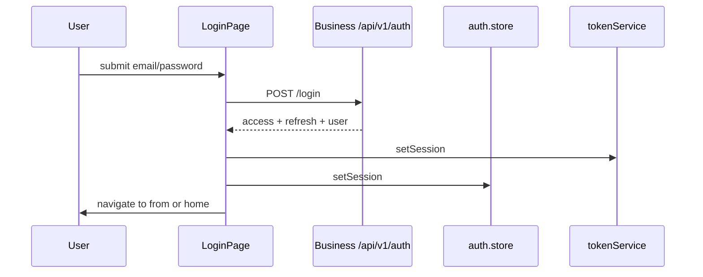

# Authentication

## JWT handling

- Access token: JWT string in `localStorage` key `acos.accessToken`
- Refresh token: opaque string `acos.refreshToken`
- Token type / expiry / serialized user also persisted (`acos.tokenType`, `acos.expiresAt`, `acos.user`)
- Documented in `token.service.ts` as intentional localStorage approach

## Login flow

Register similar via `/register` then typically proceed to authenticated use.

## Session management

On boot, `hydrate()` reads storage and sets `isAuthenticated` if user + token material exist. `ProtectedRoute` waits for `isHydrated`.

## Token refresh

Axios response interceptor on **401**:

1. Single shared `refreshPromise`
2. `POST /api/v1/auth/refresh` with refresh token (raw axios, not the intercepted client loop)
3. Replace token pair via `setTokens`
4. Retry original request
5. On failure: clear session + dispatch `acos:session-expired`

`RootLayout` listens for `acos:session-expired`, clears auth, toasts, and navigates to `/login`. Session **hydrate** also runs from `RootLayout` on boot. `authApi.me()` exists for profile refresh paths in the auth API module.

## Protected routes

`ProtectedRoute` redirects unauthenticated users to `/login` with location state.

## Logout

Calls Business logout (refresh revoke) as implemented in auth feature API, then `clearSession()` wiping storage and store.

## Interview Discussion

### Why this architecture?

Matches Business JWT + opaque refresh design; SPA-friendly without cookie/CSRF complexity for Bearer APIs.

### Alternative approaches

HttpOnly secure cookies + BFF; OIDC PKCE via Keycloak. Cookie mode is safer against XSS if XSS exists.

### Trade-offs

localStorage tokens are stolen if XSS lands — mitigated by React defaults + sanitizing markdown, but not immune.

### Scaling considerations

Silent refresh scheduling before expiry; multi-tab sync via `storage` events.

### How would this evolve?

Move refresh to HttpOnly cookie; access token memory-only.

### Common Frontend Architect interview questions

**Q1. Why refresh uses a separate axios call?**  
Avoid interceptor recursion on the shared client.

**Q2. What is hydration?**  
Restoring auth store from localStorage before rendering guarded routes.
