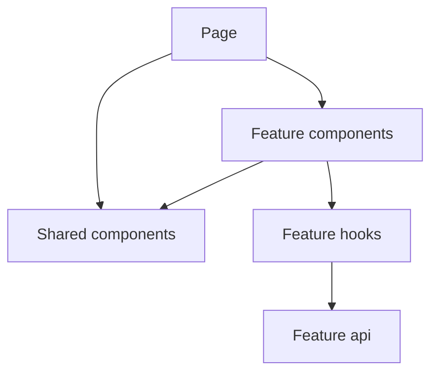

# Component Architecture

## Categories

| Category | Examples |
| --- | --- |
| **Page components** | `LoginPage`, `KnowledgeListPage`, `TutorialsHomePage`, `ApplicationsListPage`, AI pages |
| **Feature components** | Form dialogs, dashboards, tables composition, AI cards/chat, tutorial tree/Q&A/search |
| **Shared components** | DataTable, FormDialog, MarkdownViewer, ErrorBoundary |
| **Layout components** | AppLayout, AuthLayout, Sidebar, AiShell, CareerShell |

## Composition strategy

- Pages own route params and screen layout.
- Dialogs encapsulate RHF forms for create/edit.
- Tables use shared `DataTable` with feature-defined columns.
- AI feature builds a local design language (`AiCard`, `AiResultPanel`, …) on MUI.

## Reusable patterns

- FormDialog / ConfirmationDialog for modal CRUD
- SearchBar + client filter or server search
- LoadingSkeleton during queries
- MarkdownViewer with sanitization for note/AI content

## Interview Discussion

### Why this architecture?

Composition over inheritance; shared primitives reduce MUI sprawl while features keep domain UX expressive.

### Alternative approaches

Heavy headless component library; Storybook-driven atomic design only. Pragmatic shared kit fits current size.

### Trade-offs

Risk of “shared” becoming a junk drawer — review new shared components carefully.

### Scaling considerations

Publish internal UI package; Storybook for visual regression.

### How would this evolve?

Stricter presentational vs container split; command/query hooks colocation standards.

### Common Frontend Architect interview questions

**Q1. Where do CRUD dialogs live?**  
Feature `components/*FormDialog.tsx` (or Form.tsx).

**Q2. Is DataTable virtualized?**  
Pagination-first; optional lightweight virtualization cues only — not a full windowing library.
