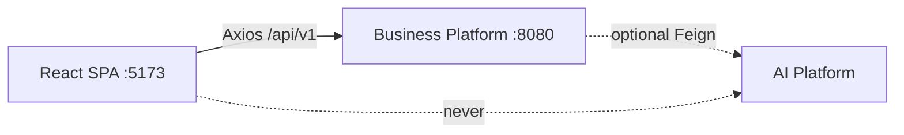

# Web Platform Architecture — Index

Chapter 05 documents the **Web Platform** implemented in `architect-career-web`: a React SPA/PWA that talks only to the Business Platform.

Audience: Principal Frontend Architects, Solution Architects, Senior React Engineers, Engineering Managers.

Integrity rule: only behavior present in `src/`, Vite/Playwright/Vitest config, or env examples is described as implemented. Gaps belong in [Future-Enhancements.md](Future-Enhancements.md).

---

## Document map

| Document | Focus |
| --- | --- |
| [Web-Platform-Overview.md](Web-Platform-Overview.md) | Purpose, stack, boundaries |
| [Application-Architecture.md](Application-Architecture.md) | Layers, features, dependency direction |
| [Project-Structure.md](Project-Structure.md) | Folder conventions |
| [Routing-Architecture.md](Routing-Architecture.md) | Public/protected routes, lazy loading |
| [State-Management.md](State-Management.md) | Zustand + TanStack Query |
| [API-Integration.md](API-Integration.md) | Axios, envelopes, AI BFF paths |
| [Authentication.md](Authentication.md) | JWT session, refresh, logout |
| [Authorization.md](Authorization.md) | Route roles, ownership via API |
| [Component-Architecture.md](Component-Architecture.md) | Pages, features, shared UI |
| [UI-Design-System.md](UI-Design-System.md) | MUI theme, typography, color |
| [Forms-and-Validation.md](Forms-and-Validation.md) | RHF + Zod |
| [Error-Handling.md](Error-Handling.md) | Boundaries, API errors, notifications |
| [Performance-Optimization.md](Performance-Optimization.md) | Code split, chunks, PWA caching |
| [Accessibility.md](Accessibility.md) | ARIA practices in use |
| [Security.md](Security.md) | Tokens, XSS, proxy |
| [Testing-Strategy.md](Testing-Strategy.md) | Vitest + Playwright |
| [Build-and-Deployment.md](Build-and-Deployment.md) | Vite build, env, no Docker yet |
| [Future-Enhancements.md](Future-Enhancements.md) | Planned gaps |

Return to portfolio home: [../README.md](../README.md)

---

## Quick orientation

**Honesty:** AI UI exists and calls `/api/v1/integration/ai/**` on Business. The capability catalog distinguishes **`planned`** (forms wired to BFF POSTs; live when controllers ship) vs **`coming_soon`** (UI cards only, no invoke). Only AI **health** is treated as live today. `VITE_AI_PLATFORM_ENABLED` defaults **false**. No generated TypeScript SDK is wired — API modules are hand-maintained. No application Dockerfile in this repo.
