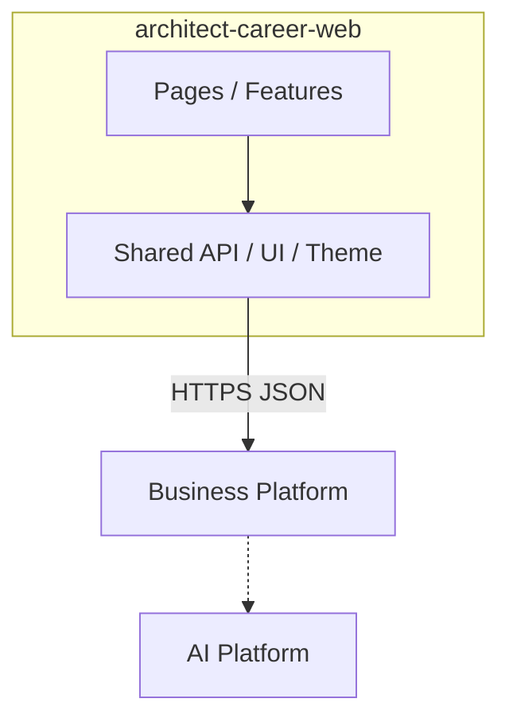

# Web Platform Overview

## Purpose

`architect-career-web` is the ACOS user interface: a **React 19 SPA with PWA support** for career, knowledge, learning, portfolio, dashboard, and AI-assisted workflows. It is the only browser-facing system in the ecosystem.

## Responsibilities

| Responsibility | Evidence |
| --- | --- |
| Authenticated product UX | Login/register, AppLayout shell, feature pages |
| Call Business REST only | Axios client + Vite `/api` proxy to `:8080` |
| Client session | JWT access + opaque refresh in `localStorage` via `tokenService` |
| Server-state caching | TanStack Query |
| Client UI state | Zustand (auth, theme, notifications) |
| Forms | React Hook Form + Zod |
| Offline / installable shell | `vite-plugin-pwa`, OfflineBanner, OfflinePage |
| AI UX (gated) | `/ai/*` routes calling Business integration paths |

**Not** this app’s responsibility: domain persistence, JWT issuance crypto, LLM calls, vector search.

## Technology Stack

| Area | Implemented |
| --- | --- |
| Runtime | Node ≥20, TypeScript 5.8 |
| UI | React 19, MUI 7, Emotion |
| Build | Vite 6 |
| Routing | react-router-dom 7 |
| Data | TanStack Query 5, Axios |
| Forms | react-hook-form, `@hookform/resolvers`, Zod |
| Client state | Zustand 5 |
| Markdown | react-markdown, rehype-sanitize, highlight.js |
| Charts | recharts |
| PWA | vite-plugin-pwa, workbox-window |
| Unit tests | Vitest, Testing Library, jsdom |
| E2E | Playwright |

## Application boundaries

## Interaction with sibling systems

### Business Platform

Sole backend. All `/api/v1/**` traffic (auth, domains, dashboard, AI integration health/BFF paths).

### AI Platform

**Never called from the browser.** AI pages use `aiApi` → Business `/api/v1/integration/ai/...`.

### Generated API SDKs

AI Contracts can generate TypeScript artifacts, but this app uses **hand-written** feature `*.api.ts` modules and shared Axios types. Do not document generated SDK as wired.

### Authentication

Login/register against Business; tokens stored client-side; Axios attaches Bearer; 401 triggers single-flight refresh.

## Interview Discussion

### Why this architecture?

SPA + BFF-style Business API keeps secrets and AI off the browser while delivering a modern React UX for a modular monolith backend.

### Alternative approaches

Next.js RSC; micro-frontends per domain; call AI from browser. Rejected for portfolio cohesion and security.

### Trade-offs

SPA SEO limited (acceptable for authenticated app). localStorage tokens are XSS-sensitive. AI UI ahead of Business BFF.

### Scaling considerations

CDN static assets; edge caching of shells; keep API NetworkOnly in service worker (already configured).

### How would this evolve?

Wire generated TS clients; complete AI BFF; optional BFF-for-Web; HttpOnly cookie session mode.

### Common Frontend Architect interview questions

**Q1. Why not call the AI Platform from React?**  
Secrets, CORS, and product authorization must stay on Business.

**Q2. Is there a generated SDK?**  
Not consumed here — hand Axios modules unwrap `ApiResponse`.
