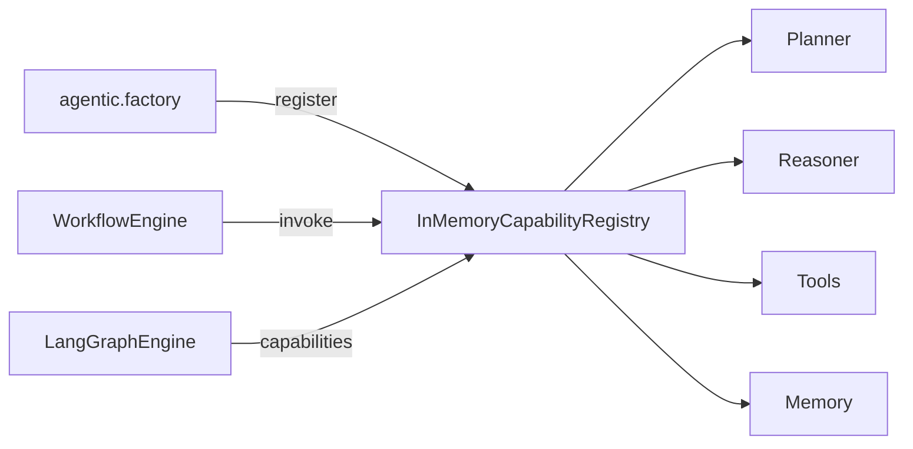

# Capability Registry

## Purpose

The capability registry is an **in-process catalog** of named, invokable AI capabilities (planner, reasoner, tools, workflows, router, memory, etc.). It decouples workflow authors from concrete classes and supports discovery by `CapabilityKind`.

Implementation: `InMemoryCapabilityRegistry` (`app.infrastructure.agentic.registry`).

## Registration

At bootstrap (`build_capability_registry` in `app.infrastructure.agentic.factory`):

1. Construct planner, reasoner, tools, memory, router, workflows, etc.
2. Call `registry.register(capability)` for each object exposing a `Capability` protocol (`descriptor` + `invoke`).
3. Names must be non-empty; duplicates overwrite by name map semantics (last write wins in dict).

Descriptors include `name`, `kind` (`CapabilityKind`), and `description`.

## Discovery

```python
registry.list()                 # all descriptors
registry.list(kind=some_kind)   # filtered
registry.get("reasoner")        # raise NotFoundError if missing
```

## Execution

```python
await registry.invoke(name, payload: dict) -> dict
```

Workflows and graph nodes invoke capabilities by name rather than importing infrastructure adapters.

## Dependency injection

Wired in `ApplicationContainer` via factory providers. Orchestration services receive the registry (or higher-level workflow engine that already holds registered capabilities).

## Extensibility

- Add a new `Capability` implementation with a descriptor.
- Register it in the agentic factory.
- Optionally expose via a workflow or tool without changing FastAPI routes.



## Why this approach was chosen

1. **Agentic composition** without hard-wiring every workflow to concrete LLM classes.
2. **Interviewable enterprise pattern** — registry/discovery akin to plugin systems.
3. **Testability** — swap in fakes by registering test doubles.
4. Avoids premature networked plugin hosts (MCP remains a separate extension point).

## Limits (honest)

- In-memory only — not a distributed service registry.
- No hot-reload from remote config.
- Not a substitute for the enterprise MCP tool registry (also in-memory stubs today).

## Interview Discussion

### Why this architecture?

Local capability registry is the right granularity before introducing networked tool protocols.

### Alternative approaches

Hard-coded service methods only; OSGi-style plugins; full MCP from day one. MCP deferred until a real host exists.

### Trade-offs

Stringly-named invoke payloads need discipline; typing is dict-in/dict-out at the registry boundary.

### Scaling considerations

Keep registry process-local; scale by replicating the app. For multi-tenant capability packs, add namespacing later.

### How would this evolve?

Versioned capability manifests; per-tenant enablement; MCP-backed remote tools registered behind the same port.

### Principal AI Architect interview questions

**Q1. Is the capability registry the same as MCP?**  
No — agentic registry is internal composition; MCP ports are separate enterprise extension stubs.

**Q2. How do workflows find retrieval?**  
Via registered retriever capability / `CapabilityRetrieverPort`, not by importing Qdrant.
