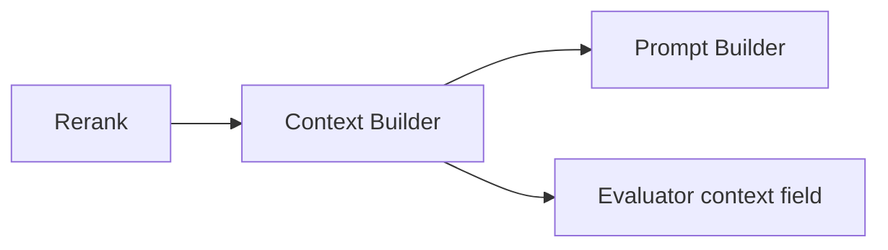

# Context Builder

## Purpose

Pack ranked retrieval hits into a token-budgeted context string for prompting / generation.

Implementation: context builder under `app.infrastructure.knowledge.context` implementing the knowledge `ContextBuilder` port.

## Behavior

- Consumes ordered `RetrievalHit` list (post-rerank).
- Respects `context_max_tokens` (default **3000**) from settings.
- Preserves hit metadata references where the builder includes them for citation-style prompts.
- Feeds summarize/chat style prompts as the `context` variable.

## Relationship to other stages

Enterprise evaluation records use the built context string when computing groundedness/precision heuristics.

## Future

- Citation markers with mandatory quote spans
- Compression / summarization of long contexts
- Lost-in-the-middle mitigation (reordering)

## Interview Discussion

### Why this architecture?

Explicit context packing prevents silently overflowing model windows and keeps prompt templates simple.

### Alternative approaches

Stuff all hits; map-reduce summarize-then-answer. Stuffing breaks at scale; map-reduce is a future workflow.

### Trade-offs

Hard token budgets may drop relevant tail hits — tune top_k and budget together.

### Scaling considerations

Estimate tokens per provider; different budgets for Ollama vs GPT-4o-mini.

### How would this evolve?

Provider-aware tokenizers; structured context blocks (JSON) for tool-calling models.

### Principal AI Architect interview questions

**Q1. Where is the budget configured?**  
`context_max_tokens` in `AppSettings`.

**Q2. Does context builder call the LLM?**  
No — pure assembly before prompt/LLM stages.
