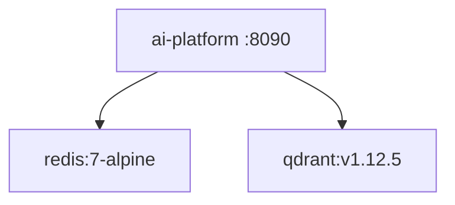

# Deployment Guide

## Docker

### Production-oriented Compose (`docker-compose.yml`)



- Builds app `Dockerfile`
- Env from `.env`
- `APP_ENV=production`
- Healthcheck: curl liveness
- **Note:** sets `OTEL_EXPORTER_OTLP_ENDPOINT=http://otel-collector:4317` but **does not define** an `otel-collector` service in this file — provide one or disable OTel

### Dev Compose (`docker-compose.dev.yml`)

- Reload uvicorn
- Mounts `app/` and `third_party/`
- Redis + Qdrant only (no OTel endpoint override)

## Run without Compose

```bash
py -3.13 -m pip install -e ".[dev]"
py -3.13 -m uvicorn app.main:app --host 0.0.0.0 --port 8090
```

## Configuration

Pydantic Settings from env / `.env`. Critical knobs:

- `APP_ENV`, `APP_PORT=8090`
- `REDIS_URL`, `REDIS_ENABLED`
- `QDRANT_URL`, `VECTOR_STORE_PROVIDER`, `EMBEDDING_PROVIDER`
- `LLM_PROVIDER`, provider API keys
- `AUTH_JWT_ENABLED` / `AUTH_API_KEY_ENABLED`
- `GUARDRAILS_*`, `ROUTING_POLICY`, `LANGFUSE_*`, `OTEL_*`

Validate via `settings.validate_for_runtime()` at startup.

## Health checks

- Liveness: `/api/v1/system/liveness`
- Readiness: `/api/v1/system/readiness`
- AI health: `/api/v1/ai/health`

## Production deployment checklist

1. Enable auth (JWT and/or API keys)
2. Set strong secrets; disable debug
3. Switch embeddings/vector store off hashing/memory defaults
4. Tighten CORS
5. Provide real OTel collector or set `OTEL_ENABLED=false`
6. Persist Redis/Qdrant volumes
7. Resource limits for embed/LLM outbound

## Future Kubernetes

Not packaged in-repo yet: Deployment, Service, Secret, HPA, PDB, NetworkPolicy denying public ingress except via Business/gateway.

## Interview Discussion

### Why this architecture?

Compose gives a realistic AI sidecar topology (API+Redis+Qdrant) matching how Business will call it.

### Alternative approaches

Serverless functions per capability — cold starts hurt RAG. Single VM without Compose — weaker parity.

### Trade-offs

OTel collector gap in Compose; Redis port defaults in settings (`6380`) may differ from Compose (`6379`) — align env explicitly.

### Scaling considerations

HPA on CPU/RPS; separate embed workers; managed Qdrant/Redis.

### How would this evolve?

Helm chart; GitOps; canary on prompt/model versions.

### Principal AI Architect interview questions

**Q1. Default port?**  
8090.

**Q2. Does Compose start a collector?**  
Not in the checked compose files — only an endpoint reference in prod compose.
