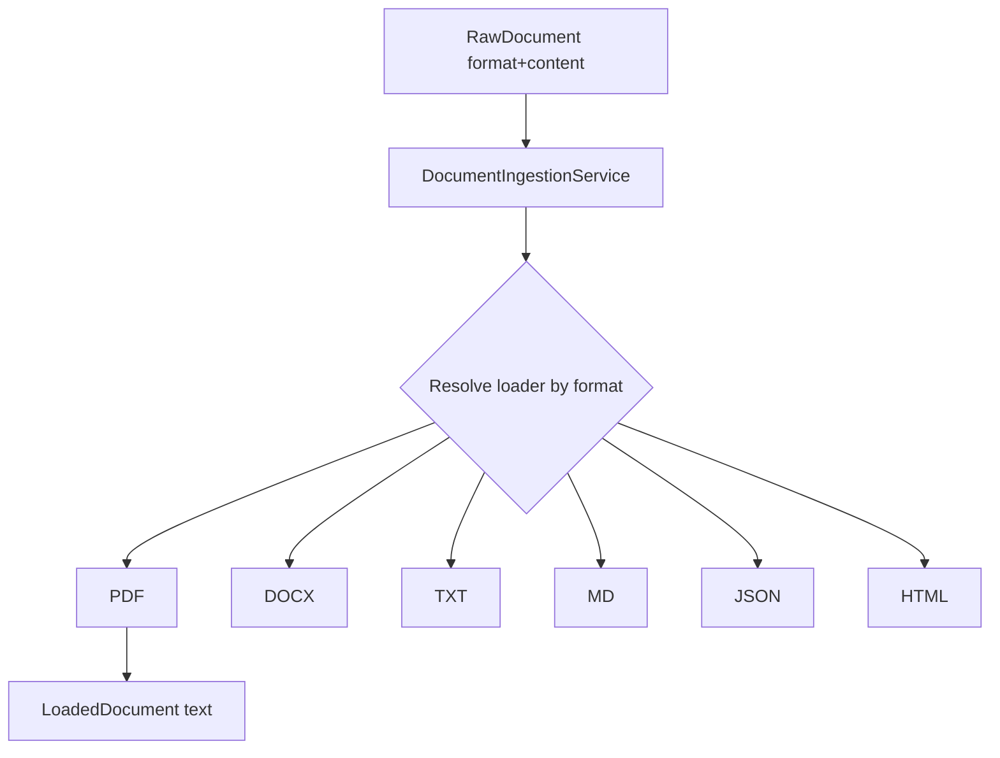

# Document Ingestion

## Purpose

Convert `RawDocument` bytes/text into a `LoadedDocument` with extracted text, using a **pluggable loader registry**.

Implementation: `DocumentIngestionService` + per-format loaders under `app.infrastructure.knowledge.ingestion`.

## Supported document types

| `DocumentFormat` | Loader |
| --- | --- |
| `pdf` | `pdf_loader` (pypdf) |
| `docx` | `docx_loader` (python-docx) |
| `txt` / `plain` | text loader |
| `markdown` | markdown loader |
| `json` | json loader |
| `html` | html loader |

Unresolved formats raise `ValidationFailedError`.

## Loader architecture

Knowledge index API typically supplies textual note content as `DocumentFormat.PLAIN` (string `content`) — there is **no multipart file-upload route** on the AI Platform today. Loaders still support richer formats when a `RawDocument` with another format is constructed internally or in future APIs.

## Preprocessing

After load, the preprocessing pipeline normalizes content (cleanup/whitespace/structure) before chunking — see `app.infrastructure.knowledge.preprocessing`.

## Metadata extraction

Metadata extractor captures document-level attributes (ids, tags, owner, language hints via `langdetect` where used) stored alongside chunks for filtered retrieval.

## OCR extension points

`UnsupportedOcrAdapter` implements `OcrPort` and **raises** `ValidationFailedError("OCR provider is not configured")`. OCR is an extension point, not a shipped provider.

## Future document types

- Images / scans via real OCR (Tesseract, cloud Vision)
- Audio transcripts
- Structured CSV/parquet tabular chunking
- Email (.eml) / Confluence export packs

## Interview Discussion

### Why this architecture?

Format-specific loaders keep PDF/DOCX quirks out of the RAG core and allow incremental format support.

### Alternative approaches

Unstructured.io as sole loader; LlamaParse. Possible later adapters behind the same port.

### Trade-offs

Maintaining loaders in-house vs vendor parsers; PDF quality varies without OCR.

### Scaling considerations

Offload large file parse to async workers; virus-scan uploads at the Business edge before AI sees bytes.

### How would this evolve?

Streaming loaders; MIME sniffing; malware scanning hooks.

### Principal AI Architect interview questions

**Q1. Is OCR available today?**  
No — port exists; default adapter rejects.

**Q2. Who owns upload UX?**  
Business/Web — AI Platform consumes content already authorized for indexing.
