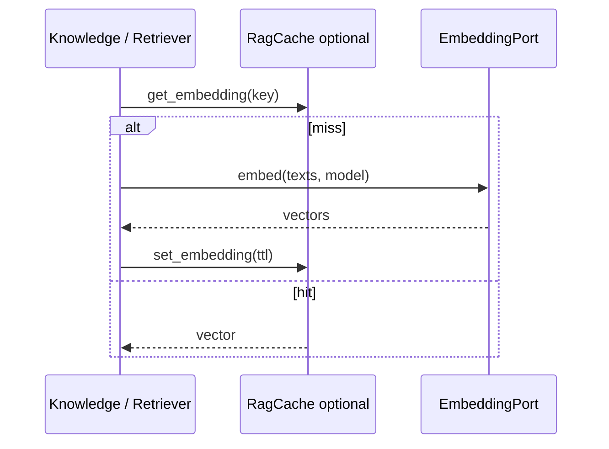

# Embedding Architecture

## Provider abstraction

Port: `EmbeddingPort` with `EmbeddingRequest` / vectors response.  
Factory: `build_embedding_port` selects adapter from `embedding_provider`.

## Providers

| Setting value | Adapter | Notes |
| --- | --- | --- |
| `hashing` (**default**) | `HashingEmbeddings` | Deterministic local vectors; `embedding_dimensions` default **64** |
| `openai` | OpenAI embeddings | `embedding_model` default `text-embedding-3-small` |
| `azure_openai` | Azure embeddings | Uses `azure_embedding_deployment` |
| `ollama` | Ollama embeddings | `ollama_embedding_model` default `nomic-embed-text` |
| `bge_m3` | BGE-M3 adapter | Requires optional `sentence-transformers` at runtime (**not** a core `pyproject` dependency) |
| `sentence_transformers` | ST adapter | Same optional dependency; default MiniLM model name in settings |

## Lifecycle

Index path embeds each chunk; query path embeds the search text once (cached when Redis/rag cache enabled).

## Caching

Retrieval pipeline uses `RagCachePort` (Redis-backed implementation available) with keys like `emb:{model}:{text}` and TTL ~3600s when cache present.

Enterprise semantic cache is separate (response-level) and excludes knowledge index/search/summarize workflows.

## Versioning

Model name is part of cache keys and settings. Changing `embedding_model` / dimensions requires **re-indexing** — old vectors are not automatically migrated.

## Future providers

- Voyage, Cohere embed, Bedrock Titan
- Multi-vector / ColBERT style representations
- Dimension reduction / Matryoshka embeddings

## Interview Discussion

### Why this architecture?

EmbeddingPort keeps vector math swappable; hashing default unblocks CI and local demos.

### Alternative approaches

Single vendor lock-in; embed inside the LLM call only. Separating embed from chat models is intentional.

### Trade-offs

Hashing similarity ≠ semantic similarity — fine for plumbing tests, wrong for product search quality.

### Scaling considerations

Batch embed APIs; async index; shared embedding microservice if many consumers appear.

### How would this evolve?

Embedding model registry with per-collection model metadata enforced at search time.

### Principal AI Architect interview questions

**Q1. Can OpenAI chat run with hashing embeddings?**  
Yes — providers are independent settings.

**Q2. What breaks if you change dimensions?**  
Qdrant collection vectors and memory store assumptions — recreate collection and reindex.
