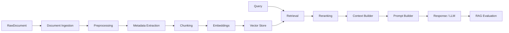

# Enterprise RAG

## Scope

Enterprise RAG in this platform covers knowledge indexing, search, and summarization under `/api/v1/ai/knowledge/*`, orchestrated by `KnowledgeService` and wrapped by the enterprise execution pipeline.

## End-to-end pipeline

| Stage | Implementation | Default behavior |
| --- | --- | --- |
| Ingestion | Loader registry (pdf/docx/txt/md/json/html/plain) | Text payloads from API index requests |
| Preprocessing | Knowledge preprocessor pipeline | Normalize/clean text |
| Metadata | Metadata extractor + repository | Owner/doc ids, tags, etc. |
| Chunking | Chunker registry | `recursive`, size 800, overlap 120 |
| Embedding | Embedding factory | **`hashing`**, dim 64 |
| Storage | Vector store factory | **`memory`** (optional Qdrant) |
| Retrieval | Dense / keyword / hybrid | Default **`dense`** |
| Re-ranking | Reranker factory | **`identity`** lexical |
| Context | Context builder | `context_max_tokens=3000` |
| Prompt | File prompts under `prompts/knowledge` | summarize `v1` |
| Generation | Response builder + LLM port | Provider from `llm_provider` |
| Evaluation | Heuristic RAG evaluator | Lexical overlap / coverage |

## Index path

1. API receives contract `KnowledgeIndexRequest` (owner, note id, title, content, tags).
2. Pipeline applies guardrails/policy/routing.
3. Knowledge service loads/preprocesses content, chunks, embeds, upserts vectors with metadata.
4. Metrics record embedding/retrieval latencies where instrumented.

## Search / summarize path

1. Embed query (with optional embedding cache).
2. Retrieve top-k (filters + optional score threshold).
3. Rerank hits.
4. Build context window.
5. For summarize: render prompt version → LLM/response builder.
6. Heuristic evaluation records quality signals.

## Enterprise controls around RAG

Knowledge workflows still pass through `AiExecutionPipeline`. Index/search/summarize are marked **non-cacheable** for semantic cache and **no soft fallback** that would fake index success incorrectly — failures surface rather than silent mock success for those workflows.

## What is not claimed

- Production-grade OCR (adapter raises until configured).
- True semantic chunking (falls back to recursive).
- LLM-as-judge faithfulness (heuristic lexical metrics only).
- Cross-encoder/Cohere rerank unless explicitly configured and dependencies present.

## Interview Discussion

### Why this architecture?

Stage-separated ports let each RAG concern evolve (chunker, store, reranker) without rewriting API contracts.

### Alternative approaches

Single LangChain `RetrievalQA` chain — faster to demo, harder to govern/swap. Monolithic embed-in-Postgres — couples SoR to vectors.

### Trade-offs

Many moving parts; defaults intentionally weak (hashing/memory) for offline CI — operators must enable real providers for quality.

### Scaling considerations

Batch embed; shard Qdrant collections by tenant; async index workers; hybrid retrieval under load.

### How would this evolve?

Parent-document retrievers, multi-vector, evaluation harness with golden sets, tenant-isolated collections.

### Principal AI Architect interview questions

**Q1. Why hashing embeddings by default?**  
Deterministic, no API key, CI-friendly — not for production semantic quality.

**Q2. Where does re-ranking sit?**  
After retrieval, before context packing — swappable via `reranker_provider`.
