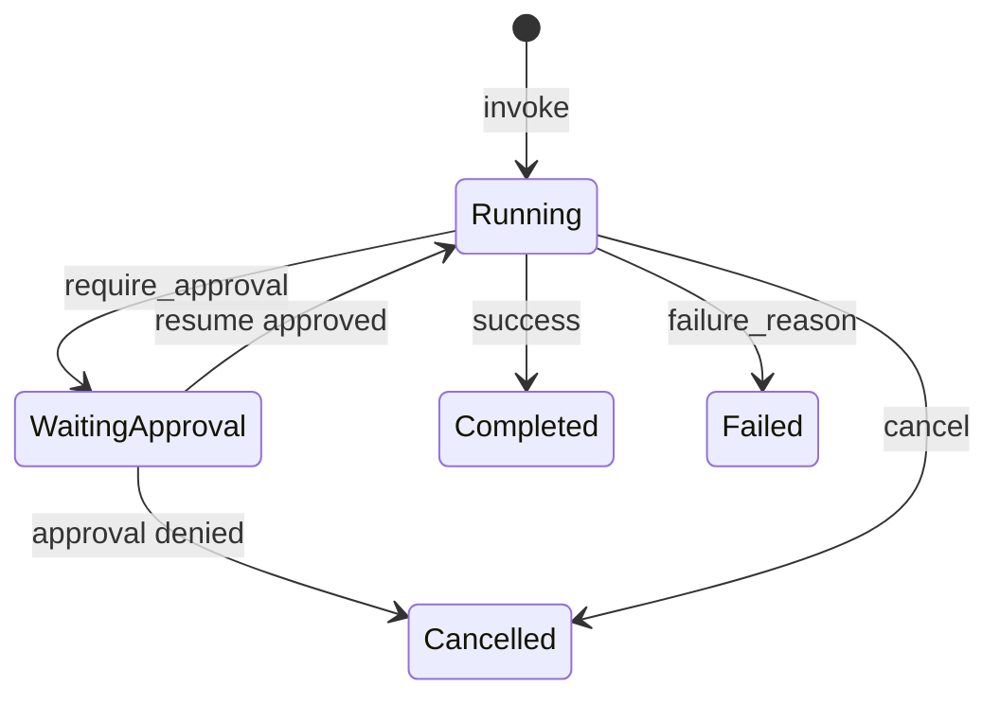

# LangGraph Orchestration

## Engine

`LangGraphEngine` (`app.infrastructure.agentic.graphs.engine`) implements `GraphEnginePort` using LangGraph `StateGraph`.

Capabilities:

- Register named `GraphDefinition`s
- `invoke` with optional `thread_id`
- In-memory **checkpoints** dict (not a durable Postgres/Redis LangGraph checkpointer)
- `require_approval` → `WAITING_APPROVAL` status (HITL gate)
- `resume(thread_id, approval=True|False)`
- `cancel(thread_id)`
- Built-in helpers: sequential, parallel, conditional graph builders

## Graph execution model

State carries `payload`, `steps`, `cancelled`, `waiting_approval`, `approved`, `failure_reason`.

## Registered demo graphs

`build_graph_engine` registers illustrative graphs (not product HTTP flows):

| Graph | Pattern | Honesty |
| --- | --- | --- |
| `capability_sequential` | plan → retrieve → reason → format | Demo nodes set flags; not the Business Feign path |
| `capability_conditional` | route → branch_a / branch_b | Demo |
| `capability_parallel` | asyncio gather helper | Parallel helper; not a full LangGraph compile path |

**Product AI routes** (chat, quiz, resume, etc.) run through `DefaultWorkflowEngine` + workflow classes — **not** these LangGraph demos.

`AgenticOrchestrationService.run_graph` exists for graph invoke/resume/cancel but has **no FastAPI route** today.

## Relationship to planner / reasoner / retriever / tools

Workflows (and graph demos) compose registered capabilities:

| Concern | Component |
| --- | --- |
| Plan | `HeuristicPlanner` |
| Retrieve | `MultiSourceCapabilityRetriever` |
| Reason | `LlmReasoner` |
| Tools | `DefaultToolRegistry` + builtins |
| Format | `DefaultResponseFormatter` |

LangGraph is the **graph substrate** (seq/conditional/HITL). The Workflow Engine is what backs contract HTTP endpoints.

## Checkpointing

- Process-local `_checkpoints` map keyed by `thread_id`
- Lost on process restart — **not** production-durable HITL storage

## Future Human-in-the-Loop

Durable checkpointer (Redis/Postgres), approval APIs exposed over HTTP, UI integration via Business BFF, multi-approver policies.

## Interview Discussion

### Why this architecture?

LangGraph gives explicit control flow (seq/parallel/conditional) and a place for HITL without rewriting FastAPI handlers per graph.

### Alternative approaches

Pure asyncio pipelines; Temporal workflows. LangGraph fits Python AI stack already in use.

### Trade-offs

In-memory checkpoints limit multi-instance HITL. Graph definitions must stay domain-agnostic per engine comments.

### Scaling considerations

Externalize checkpoint store before horizontal scale with approvals; sticky sessions otherwise.

### How would this evolve?

HTTP graph run APIs; visual graph registry; streaming node events.

### Principal AI Architect interview questions

**Q1. Is HITL production-ready?**  
API/engine support exists; storage is in-memory — call it readiness, not durable HITL.

**Q2. Do all REST endpoints use LangGraph?**  
No — contract routes use WorkflowEngine. LangGraph demos and `run_graph` are not HTTP-exposed.
