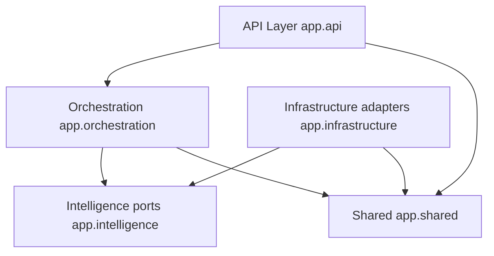
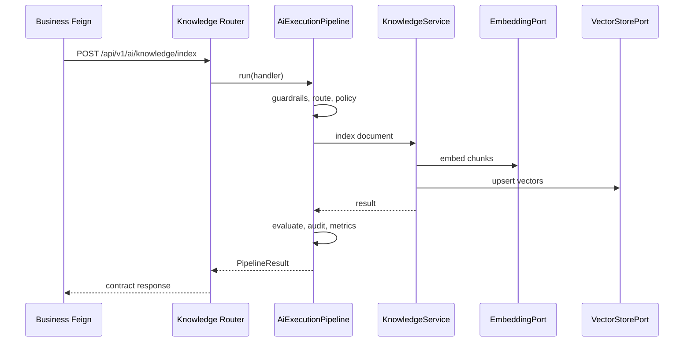

# Layered Architecture

## Layers

Dependency rule: **orchestration and API depend on intelligence ports; infrastructure implements those ports; shared is cross-cutting**. Adapters must not be imported by API handlers directly when a port/facade exists.

## API Layer (`app.api`)

- FastAPI routers for knowledge, chat, learning, career, portfolio, health, system probes
- Middleware: CORS, `RequestContextMiddleware` (correlation), `RateLimitMiddleware`
- Dependencies: auth service, pipelined facades from DI
- Exception handlers mapping platform errors to HTTP

## Middleware / enterprise pipeline (`app.orchestration.enterprise`)

Not HTTP middleware alone — the **AI execution pipeline** wraps every workflow:

Authz context → correlation → guardrails → prompt governance → model routing → policy → resilient execution → evaluation → observability/metrics → transform → audit.

Implemented as `AiExecutionPipeline` with pipelined knowledge/agentic facades.

## Orchestration Layer (`app.orchestration`)

- `KnowledgeService` / knowledge orchestration for RAG use cases
- `AgenticOrchestrationService` for chat and domain AI workflows
- Enterprise facades that bind handlers into the pipeline

## Capability / intelligence Layer (`app.intelligence`)

Ports and models only (Clean Architecture inward):

- `intelligence.knowledge.*` — ingestion, chunking, embeddings, vectorstore, retrieval, rerank, context, prompt, response, evaluation, caching
- `intelligence.agentic.*` — registry, planner, reasoner, tools, memory, graphs, workflows, router
- `intelligence.enterprise.*` — pipeline, guardrails, policy, governance, cost, cache, MCP, A2A, audit, security
- `intelligence.llm` / `embeddings` / `tools` ports

## Infrastructure Layer (`app.infrastructure`)

Concrete adapters: OpenAI/Azure/Ollama LLMs, embedding providers, Qdrant/memory stores, Redis cache, LangGraph engine, file prompts, heuristic guardrails/evaluators, MCP/A2A in-memory stubs, OTel/LangFuse adapters.

## Shared Layer (`app.shared`)

Settings (`AppSettings`), DI `ApplicationContainer`, logging, metrics, resilience patterns (retry/timeout/circuit/bulkhead/fallback), request context, authentication helpers, exceptions.

## Request flow (knowledge index)

## Interview Discussion

### Why this architecture?

Ports/adapters isolate vendor SDKs (OpenAI, Qdrant, Redis) so tests can run on hashing/memory without cloud keys, matching AI change velocity.

### Alternative approaches

Framework-first LangChain apps with thin FastAPI; hexagonal purity without orchestration package. Current split balances testability and delivery.

### Trade-offs

More types and factories; newcomers must learn port locations. Worth it for swappable providers.

### Scaling considerations

Scale API horizontally; keep vector/Redis shared; move long ingest to workers without changing ports.

### How would this evolve?

Stronger module packaging (installable libs), async job API, stricter import-linter rules.

### Principal AI Architect interview questions

**Q1. Where do you add a new embedding vendor?**  
Implement `EmbeddingPort` adapter + factory branch; no API change.

**Q2. Why not call OpenAI from the router?**  
Breaks Clean Architecture and makes Business-facing APIs untestable offline.
