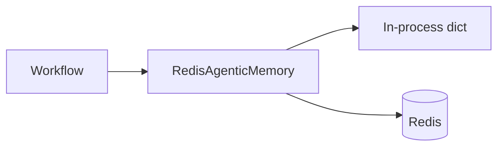

# Memory Architecture

## Implementation

`RedisAgenticMemory` implements `AgenticMemoryPort`:

- Scopes via `MemoryScope` (conversation/session/long/short/working — as modeled)
- Keys namespaced `agentic:memory:{scope}:{key}`
- Writes to local process dict **and** Redis when `redis_enabled`
- Reads prefer local, then Redis JSON payloads

Conversation manager: `MemoryConversationManager` builds on memory for chat history patterns.

## Diagram

## Limits

- Not a full vector memory / episodic store.
- Local dict is per process — multi-replica consistency relies on Redis.
- If Redis disabled, memory is ephemeral process-local.

## Future

- Vector episodic memory
- Summarized long-term profiles
- Per-tenant encryption at rest
- TTL policies per scope

## Interview Discussion

### Why this architecture?

Scoped key-value memory is enough for conversation continuity without overbuilding a memory microservice.

### Alternative approaches

Only LLM context window; LangGraph store; Postgres memory tables. Redis fits existing AI platform cache dependency.

### Trade-offs

Dual local+Redis can surprise on multi-worker freshness — Redis is source for cross-process.

### Scaling considerations

Redis Cluster; key TTLs; avoid huge payloads in memory records.

### How would this evolve?

Memory tools for agents; automatic summarization compaction.

### Principal AI Architect interview questions

**Q1. Is memory durable?**  
When Redis enabled and persisted — yes across app restarts; local-only otherwise.

**Q2. Does RAG use this memory?**  
RAG uses vector store; agentic memory is for workflow/conversation state.
