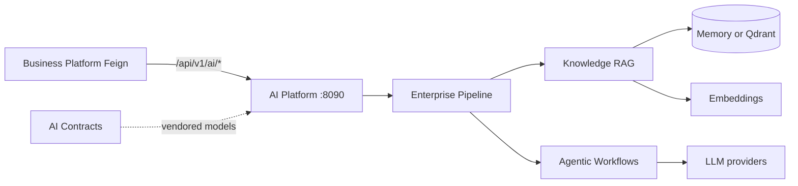

# AI Platform Architecture — Index

Chapter 06 documents the **AI Platform** implemented in `architect-career-ai-platform`: a domain-agnostic FastAPI service for RAG, agentic workflows, enterprise middleware, and contract-aligned AI APIs.

Audience: Principal AI Architects, Staff AI Engineers, Engineering Managers, Senior Python Engineers.

Integrity rule: only behavior present in Python sources, settings, prompts, Docker Compose, or tests is described as implemented. Gaps belong in [Future-Enhancements.md](Future-Enhancements.md).

---

## Document map

| Document | Focus |
| --- | --- |
| [AI-Platform-Overview.md](AI-Platform-Overview.md) | Purpose, stack, ecosystem role |
| [Layered-Architecture.md](Layered-Architecture.md) | API → orchestration → intelligence → infrastructure |
| [Capability-Registry.md](Capability-Registry.md) | Register / discover / invoke capabilities |
| [Enterprise-RAG.md](Enterprise-RAG.md) | End-to-end RAG pipeline |
| [Document-Ingestion.md](Document-Ingestion.md) | Loaders and formats |
| [Chunking-Strategy.md](Chunking-Strategy.md) | Chunkers and overlap |
| [Embedding-Architecture.md](Embedding-Architecture.md) | Embedding ports and providers |
| [Vector-Database.md](Vector-Database.md) | Memory + Qdrant stores |
| [Retrieval-Architecture.md](Retrieval-Architecture.md) | Dense / keyword / hybrid |
| [Re-ranking.md](Re-ranking.md) | Reranker providers |
| [Context-Builder.md](Context-Builder.md) | Context packing |
| [Prompt-Management.md](Prompt-Management.md) | File prompts + governance |
| [LLM-Abstraction.md](LLM-Abstraction.md) | OpenAI / Azure / Ollama |
| [LangGraph-Orchestration.md](LangGraph-Orchestration.md) | Graph engine |
| [Workflow-Engine.md](Workflow-Engine.md) | Agentic workflows |
| [Tool-Registry.md](Tool-Registry.md) | Built-in tools |
| [Memory-Architecture.md](Memory-Architecture.md) | Scoped agentic memory |
| [Model-Router.md](Model-Router.md) | Routing policies |
| [Guardrails.md](Guardrails.md) | Input/output safety |
| [Evaluation.md](Evaluation.md) | Heuristic + enterprise eval |
| [Observability.md](Observability.md) | Logs, metrics, OTel, LangFuse |
| [Security.md](Security.md) | Authn options, pipeline security |
| [Testing-Strategy.md](Testing-Strategy.md) | Pytest strategy |
| [Performance-and-Scaling.md](Performance-and-Scaling.md) | Cache, concurrency, scale |
| [Deployment-Guide.md](Deployment-Guide.md) | Docker, env, health |
| [Future-Enhancements.md](Future-Enhancements.md) | Not yet implemented |

Return to portfolio home: [../README.md](../README.md)

---

## Quick orientation

**Defaults that matter for demos:** `embedding_provider=hashing`, `vector_store_provider=memory`, `reranker_provider=identity`, `auth_jwt_enabled=false`, `langfuse_enabled=false`, `guardrails_enabled=true`.

**Stubs / partials:** OCR adapter raises until configured; semantic chunking falls back to recursive; MCP/A2A are in-memory extension points; LangGraph demos are not HTTP product routes; OTel packages present but auto-instrumentation not applied; Compose production file references an OTLP collector that is not defined in the same file; settings Redis default port `6380` vs Compose `6379` — align via `REDIS_URL`.
