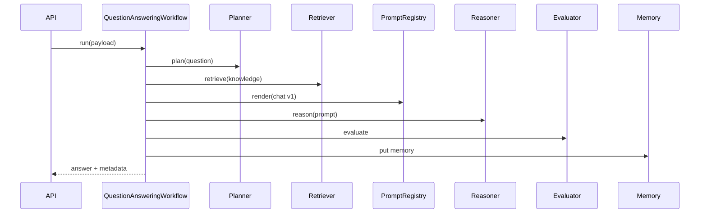

# Workflow Engine

## Purpose

`DefaultWorkflowEngine` registers and runs named agentic workflows that orchestrate capabilities (planner, retriever, prompts, reasoner, tools, memory, evaluator).

Default workflow setting: `agentic_default_workflow=question_answering`.

## Implemented workflows

Registered in `build_workflow_engine` / `definitions.py`:

| Workflow name | Role |
| --- | --- |
| `question_answering` | Chat-style QA with retrieval + prompt + reason + eval + memory |
| `summarization` | Summarize with context |
| `retrieval` | Retrieval-focused flow |
| `reasoning` | Reasoner-centric |
| `quiz` | Learning quiz generation |
| `recommend_topic` / recommend flow | Next topic recommendation |
| `progress_evaluation` | Learning progress |
| `resume` | Career resume generation |
| `interview` | Interview analysis |
| `cover_letter` | Cover letter generation |
| `portfolio_review` | Portfolio review |
| `skill_gap` | Skill gap analysis |

Exact name strings match factory registration — workflows map to FastAPI routes via `AgenticOrchestrationService` / pipelined facades.

## Execution pattern (QA example)

## Enterprise wrapping

HTTP handlers invoke pipelined facades so each workflow execution still passes guardrails, routing, policy, cost, audit.

## Interview Discussion

### Why this architecture?

Workflows encode product AI use cases while remaining swappable/testable units independent of FastAPI.

### Alternative approaches

One mega-graph for all products; prompt-only without retrieval. Explicit workflows match contract endpoints 1:1.

### Trade-offs

Some duplication across career/learning workflows — mitigated by shared capabilities.

### Scaling considerations

Queue long workflows; idempotency keys; per-workflow concurrency limits via bulkhead.

### How would this evolve?

Declarative YAML workflow defs; customer-defined workflows; stronger schema validation on payloads.

### Principal AI Architect interview questions

**Q1. How does chat reach QA workflow?**  
`POST /api/v1/ai/chat/completions` → agentic orchestration → default/selected workflow inside pipeline.

**Q2. Are workflows capabilities?**  
They are registered/run via the workflow engine and participate in the broader capability ecosystem.
