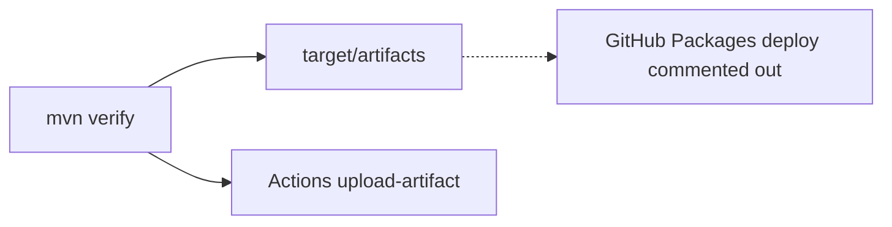

# Artifact Publishing

## Build pipeline

`mvn clean verify` stages publishable files under `target/artifacts/` after generation and language validation.

## Generated artifacts

| File | Contents |
| --- | --- |
| `career-ai-java-sdk.jar` | Compiled Feign clients + models |
| `career-ai-python-sdk.zip` | Python package tree |
| `career-ai-typescript-sdk.zip` | TS Axios client package |

CI uploads these as GitHub Actions artifacts (`career-ai-sdk-artifacts`).

## Publishing workflow (current)

- `distributionManagement` exists in `pom.xml` for future GitHub Packages
- Workflow publish step is **commented / stubbed** (`packages: write` not enabled)
- Consumers today: **file vendoring** (AI Platform) or path alignment (Business/Web)

## Version management

`VERSION` file + Maven/`package.json` version **1.0.0**; bump with CHANGELOG on release.

## Interview Discussion

### Why Contract First?

Artifacts are mechanical outputs of the SoT — publishing becomes a release concern, not a design concern.

### Alternative approaches

Always commit generated sources — rejected here (`target/` only).

### Trade-offs

Until Packages publish is enabled, teams copy/vendor zips manually.

### Why not shared DTO libraries?

Published SDKs per language from one contract.

### Why OpenAPI?

One input → many artifacts.

### When would you choose gRPC?

Publish `.proto` + generated stubs to the same registries.

### Scaling considerations

Enable `mvn deploy` on main; semantic-release VERSION bumps.

### Principal API Architect interview questions

**Q1. Where do I get the JAR in CI?**  
Download the workflow artifact or run verify locally.

**Q2. Is npm publish configured?**  
TS is zipped as an artifact; public npm publish is not the current pipeline.
