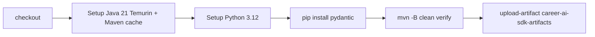

# CI/CD Pipeline

## Workflow

File: `.github/workflows/validate-and-generate.yml`

| Trigger | Branches / events |
| --- | --- |
| `push` | `main`, `master` |
| `pull_request` | all |
| `workflow_dispatch` | manual |

Permissions: `contents: read` (packages write commented for future publish).

## Job: `contracts`

Timeout: 45 minutes. Runner: `ubuntu-latest`.

## Artifact generation

`mvn clean verify` produces:

- `target/artifacts/career-ai-java-sdk.jar`
- `target/artifacts/career-ai-python-sdk.zip`
- `target/artifacts/career-ai-typescript-sdk.zip`

Uploaded as Actions artifact **`career-ai-sdk-artifacts`** with `if-no-files-found: error`.

## Validation

Entire validate → generate → compile → package chain runs inside Maven (see [Validation-Pipeline.md](Validation-Pipeline.md)). No separate “lint-only” CI job.

## Publishing

Remote publish is **stubbed**:

- `distributionManagement` present in `pom.xml` for GitHub Packages
- Workflow `mvn deploy` step commented
- `packages: write` permission not enabled
- Java setup `server-id: github` credentials commented

## Release process (as implemented)

1. Change OpenAPI/AsyncAPI + `CHANGELOG.md` / `VERSION` as needed  
2. Open PR → workflow must pass  
3. Merge to main → workflow uploads artifacts  
4. Consumers sync manually (AI: `sync_contracts.py`; Business/Web: align clients)  
5. Future: uncomment deploy for registry publish on main

## Interview Discussion

### Why Contract First?

PR CI is the contract quality gate for the whole ecosystem.

### Alternative approaches

Generate only on developer laptops — non-reproducible.

### Trade-offs

Until Packages publish is live, artifact distribution is Actions download / local verify.

### Why not shared DTO libraries?

One pipeline builds three language packs from one verify.

### Why OpenAPI?

Fits Maven generator plugin + Node validators in one job.

### When would you choose gRPC?

CI would run `buf generate` + language builds similarly.

### Scaling considerations

Matrix jobs; semantic-release; required status checks on consumer repos when versions bump.

### Principal API Architect interview questions

**Q1. Does merge publish to Maven Central?**  
No — local/GitHub artifact upload only; deploy stubbed.

**Q2. Python version in CI?**  
3.12 (AI Platform may use 3.13 locally; contracts CI pins 3.12 + pydantic).
