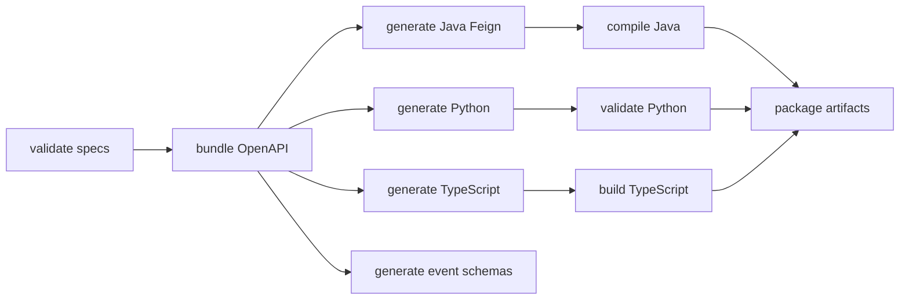

# Code Generation

## Generation workflow

Driven primarily by **Maven** (`mvn clean verify`):

Profiles: `all` (default), `-Pjava`, `-Ppython`, `-Ptypescript`.

Helper scripts wrap Maven (`scripts/generate-all.sh`, etc.). Legacy `npm run generate` remains for ad-hoc Node flows; **CI uses Maven**.

## Tooling

- `openapi-generator-maven-plugin` **7.12.0**
- Node toolchain via `frontend-maven-plugin` (Node **20.18.0** / npm **10.8.2** in the Maven build)
- Configs: `generator/java|python|typescript/openapi-generator-config.yaml` (reference; Maven embeds the same options)
- `skipIfSpecIsUnchanged: true` on generators
- Post-process: `patch-java-sources.mjs` (generator defect fixes), `patch-typescript-sources.mjs` + `build-typescript.mjs`
- Events: custom `generate-events.mjs` JSON Schema export (not AsyncAPI Generator CLI)

## Language outputs

| Language | Generator intent | Output dir |
| --- | --- | --- |
| Java | Feign library, Jakarta EE, Bean Validation, Jackson | `target/generated/java` |
| Python | `acos_ai_contracts` package | `target/generated/python` |
| TypeScript | Axios client `@acos/ai-contracts` | `target/generated/typescript` |
| Events | JSON Schemas / catalogs | `target/generated/asyncapi` |

## Generated artifacts (packaged)

| Artifact | Path |
| --- | --- |
| Java SDK JAR | `target/artifacts/career-ai-java-sdk.jar` |
| Python SDK ZIP | `target/artifacts/career-ai-python-sdk.zip` |
| TypeScript SDK ZIP | `target/artifacts/career-ai-typescript-sdk.zip` |

**Not committed** — only `target/` (and placeholder `generated/README.md`).

## Build lifecycle (summary)

`validate` → `generate-sources` → `process-sources/resources` → `compile` → `prepare-package` → `package` → `verify` (stage artifacts).

## Interview Discussion

### Why Contract First?

Generators amplify a good contract and punish a bad one early in CI.

### Alternative approaches

Hand-written clients only — what Web/Business still partially do; generation is the target discipline for AI.

### Trade-offs

Upstream generator limitations (Java records); must re-vendor Python into AI Platform.

### Why not shared DTO libraries?

Generation from OpenAPI replaces per-language hand DTOs.

### Why OpenAPI?

Best multi-language generator ecosystem for HTTP.

### When would you choose gRPC?

`protoc` plugins instead of OpenAPI Generator.

### Scaling considerations

Cache Node/Maven in CI; fail PRs on verify.

### Principal API Architect interview questions

**Q1. Does `mvn verify` publish to Maven Central?**  
No — packages locally; remote deploy stubbed.

**Q2. Can I edit generated Java?**  
No — regenerate from YAML.
