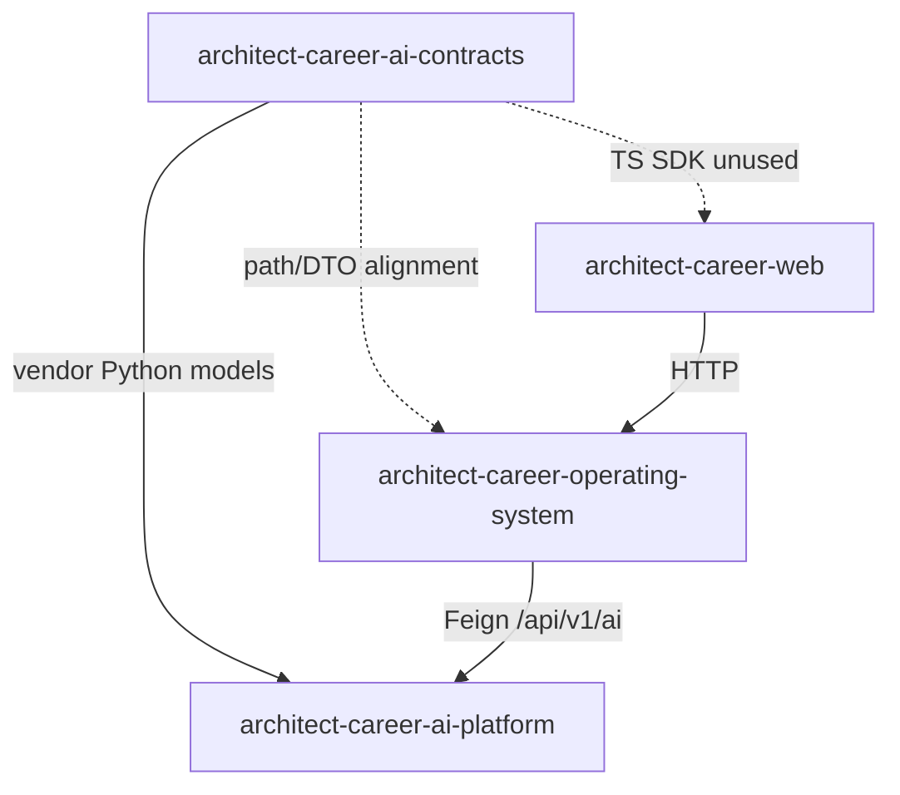

# Consumer Integration

## Repository interaction

## Business Platform

- Hand-written Spring Cloud OpenFeign clients under `com.acos.integration.client` (not the generated JAR)
- **Path-aligned today:** Knowledge, Learning, Career, Portfolio AI clients match OpenAPI paths
- **Not present as Feign clients:** Chat (`/api/v1/ai/chat/completions`) and AI health (`/api/v1/ai/health`) — health is handled via Business integration health services/Actuator, not a generated Health Feign API
- DTOs largely **hand-maintained** under `integration`
- Adopting `career-ai-java-sdk.jar` remains a future hardening step

## AI Platform

- Depends on `acos-ai-contracts` via **`third_party/acos_ai_contracts`** file dependency
- FastAPI request/response models align with generated Pydantic types
- After contract changes: regenerate, refresh vendored tree, run AI tests

## Web Platform

- Never calls AI Platform directly
- Uses hand Axios modules against Business `/api/v1/integration/ai/**`
- Generated `@acos/ai-contracts` TS client is **produced but not wired** in the Web repo

## Dependency management

| Artifact | Consumption mode today |
| --- | --- |
| Java JAR | Local/CI artifact; not mandatory Maven dep in Business |
| Python ZIP / tree | Vendored into AI Platform |
| TypeScript ZIP | Artifact only |

## Interview Discussion

### Why Contract First?

Consumers share one vocabulary even when integration modes differ (vendor vs hand client).

### Alternative approaches

Copy JSON samples in Slack — rejected.

### Trade-offs

Uneven adoption (Python vendored, TS unused, Java partial) until packaging publish lands.

### Why not shared DTO libraries?

Would not serve Python FastAPI cleanly.

### Why OpenAPI?

Same paths documented for Feign and FastAPI.

### When would you choose gRPC?

If Business↔AI moved to binary mesh — contracts repo would own `.proto` instead.

### Scaling considerations

Make Java SDK a real Maven dependency; wire TS when Web talks typed BFF.

### Principal API Architect interview questions

**Q1. Does Web import OpenAPI?**  
Not currently.

**Q2. How does AI stay in sync?**  
Regenerate + replace `third_party/acos_ai_contracts`.
