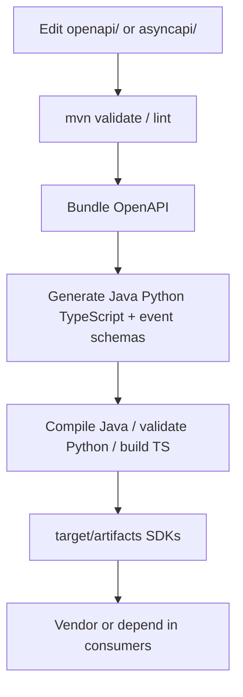
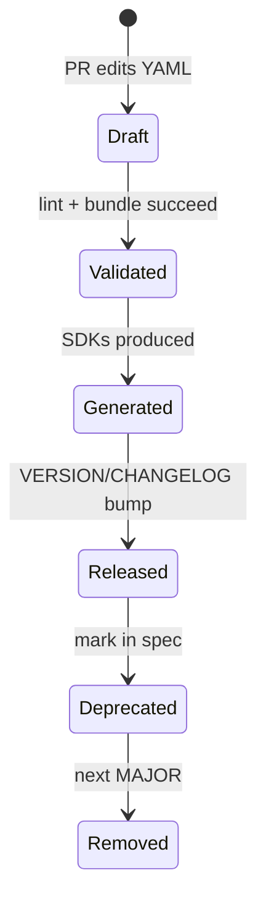

# Contract-First Architecture

## Why Contract First

AI integration crosses **three languages** (Java Business, Python AI, TypeScript Web) and two protocols (REST + future events). Designing the interface before implementations prevents incompatible Feign clients, FastAPI models, and browser payloads.

## Benefits

- Single reviewable SoT in Git
- Parallel implementation (AI Platform + Business Feign) against the same paths
- Generated clients reduce boilerplate
- Breaking changes become explicit SemVer/MAJOR discussions

## Trade-offs

- Upfront authoring cost
- Generator quirks (e.g., Java native `record` limits)
- Must discipline consumers to regenerate/vendor after changes

## Implementation workflow

1. Author/change YAML under `openapi/` or `asyncapi/` only.
2. Run `mvn clean verify` (or language profile).
3. Consume `target/artifacts/*` or `target/generated/*`.
4. OpenAPI Generator skips regen when bundled spec unchanged (`skipIfSpecIsUnchanged`).

## Contract lifecycle

Governance docs in-repo (`docs/contract-first.md`, rest/event guidelines) reinforce this flow.

## Interview Discussion

### Why Contract First?

The AI boundary is the multi-language integration choke point — contracts beat ad-hoc DTO copying.

### Alternative approaches

Code-first annotations exported later — tends to bias one language and surprise others.

### Trade-offs

Slower first feature; faster safe evolution.

### Why not shared DTO libraries?

Language lock-in; contracts stay JSON-schema portable.

### Why OpenAPI?

Industry standard for HTTP; rich generators.

### When would you choose gRPC?

When binary perf and streaming dominate and browsers are not direct clients.

### Scaling considerations

Treat contract PRs as API design reviews with compatibility checklists.

### Principal API Architect interview questions

**Q1. Who owns the AI paths?**  
This contracts repo owns the SoT; AI Platform implements; Business consumes.

**Q2. Can Web invent a field?**  
No — extend OpenAPI first, then regenerate/adapt clients.
