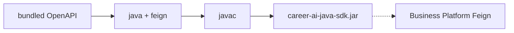

# Java SDK

## What is generated

Maven OpenAPI Generator (`generatorName: java`, `library: feign`) produces:

| Surface | Package |
| --- | --- |
| Feign API interfaces | `com.acos.ai.contracts.api` |
| Request/response models | `com.acos.ai.contracts.model` |
| Invoker / ApiClient helpers | `com.acos.ai.contracts` |

Output directory during build: `target/generated/java`. Packaged artifact: `target/artifacts/career-ai-java-sdk.jar` (`groupId`/`artifactId` in generator config: `com.acos.ai` / `career-ai-java-sdk`).

## OpenFeign

- Feign clients encode HTTP methods, paths, and media types from the bundled OpenAPI
- Runtime deps declared on the contracts POM include `feign-core`, `feign-jackson`, `feign-okhttp`, `feign-form`, `feign-slf4j`
- Intended consumer pattern: Business Platform OpenFeign integration layer calling AI Platform `/api/v1/ai/**`

**Current adoption:** Business Platform Feign clients and DTOs are largely **hand-aligned** to Knowledge / Learning / Career / Portfolio paths; Chat and Health are not mirrored as Feign clients. The generated JAR is produced and CI-uploaded but is **not** a Maven dependency of `architect-career-operating-system` today.

## Models (not native records)

Despite the config comment “Feign + records”, upstream OpenAPI Generator Feign templates emit **Jackson-annotated POJOs** with Jakarta Bean Validation—not Java `record` types. Documented explicitly in `generated/README.md` and `generator/java/README.md`.

Consumers may map generated DTOs to domain records at an anti-corruption boundary if desired.

## Validation

- `useBeanValidation` / `performBeanValidation` enabled in generator config
- Models carry Jakarta Validation annotations derived from OpenAPI constraints
- Contracts build also compiles the generated Java sources (`maven-compiler-plugin`) as a compile-time gate

## Integration guidance

1. Prefer depending on the published/local `career-ai-java-sdk` JAR once registry publish is enabled
2. Until then, keep Feign method signatures and JSON property names aligned with OpenAPI `operationId`s and schemas
3. Never hand-edit generated sources under `target/generated/java`

## Interview Discussion

### Why Contract First?

Feign method names and JSON shapes come from one reviewed YAML change set.

### Alternative approaches

Share a Java-only DTO JAR authored by hand — breaks Python FastAPI alignment.

### Trade-offs

Generator POJOs vs preferred records; dual maintenance until Business adopts the JAR.

### Why not shared DTO libraries?

A Java DTO library would not produce Pydantic or Axios clients.

### Why OpenAPI?

Feign generation is mature for REST HTTP.

### When would you choose gRPC?

If Business↔AI moved to protobuf stubs instead of Feign/HTTP.

### Scaling considerations

Make the JAR a real dependency; add contract tests that Feign stubs match OpenAPI.

### Principal API Architect interview questions

**Q1. Are models Java records?**  
No — Jackson POJOs; records are an application-layer option.

**Q2. Does Business compile against the SDK today?**  
Not as a declared dependency; path/DTO alignment is manual.
