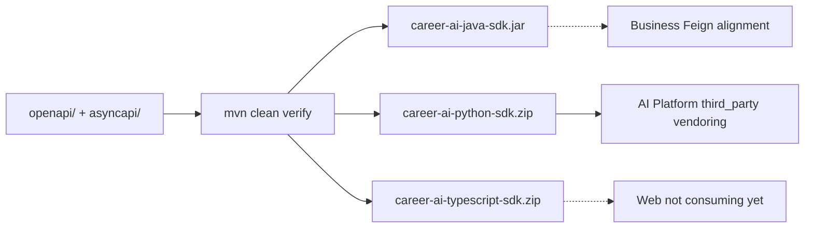

# AI Contracts Architecture — Index

Chapter 07 documents **`architect-career-ai-contracts`**: the contract-first source of truth for ACOS AI REST (OpenAPI 3.1) and events (AsyncAPI 3.0), plus multi-language SDK generation.

Audience: Principal Architects, Platform Engineers, API Architects, Integration Architects.

Integrity rule: only behavior present in `openapi/`, `asyncapi/`, `generator/`, `pom.xml`, scripts, CI, or consumer wiring is described as implemented. Gaps belong in [Future-Enhancements.md](Future-Enhancements.md).

---

## Document map

| Document | Focus |
| --- | --- |
| [AI-Contracts-Overview.md](AI-Contracts-Overview.md) | Purpose, stack, consumers |
| [Contract-First-Architecture.md](Contract-First-Architecture.md) | Why contracts lead; lifecycle |
| [OpenAPI-Architecture.md](OpenAPI-Architecture.md) | Aggregated REST surface |
| [AsyncAPI-Architecture.md](AsyncAPI-Architecture.md) | Event channels (spec-first) |
| [Schema-Design.md](Schema-Design.md) | Shared schemas, errors, pagination |
| [Reusable-Components.md](Reusable-Components.md) | `$ref` modules |
| [Code-Generation.md](Code-Generation.md) | OpenAPI Generator workflow |
| [Artifact-Publishing.md](Artifact-Publishing.md) | `target/artifacts` + stubbed deploy |
| [Versioning-Strategy.md](Versioning-Strategy.md) | SemVer + `/api/v1` |
| [Backward-Compatibility.md](Backward-Compatibility.md) | Evolution rules |
| [Consumer-Integration.md](Consumer-Integration.md) | Business / AI / Web usage |
| [Java-SDK.md](Java-SDK.md) | Feign + Jackson models |
| [Python-Models.md](Python-Models.md) | Pydantic package |
| [TypeScript-SDK.md](TypeScript-SDK.md) | Axios client (generated; Web not wired) |
| [Validation-Pipeline.md](Validation-Pipeline.md) | Lint/bundle/verify |
| [CI-CD-Pipeline.md](CI-CD-Pipeline.md) | GitHub Actions |
| [Governance.md](Governance.md) | Standards and ownership |
| [Repository-Workflow.md](Repository-Workflow.md) | Edit → verify → consume |
| [Future-Enhancements.md](Future-Enhancements.md) | Publishing, brokers, SDK adoption |

Return to portfolio home: [../README.md](../README.md)

---

## Quick orientation

**Honesty:** Generated code is **not committed** (`target/` only). Remote registry publish is **stubbed**. AsyncAPI has **no live broker** in Business/AI. Business Feign clients are largely **hand-aligned** today; AI Platform **vendors** Python models; Web does **not** use the TS SDK yet.
