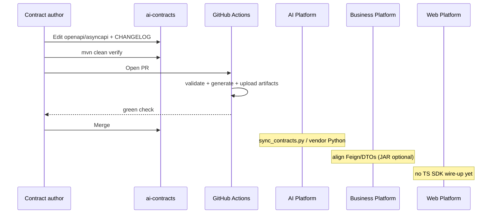

# Repository Workflow

## Edit → verify → consume

## Day-to-day commands

| Goal | Command |
| --- | --- |
| Full gate | `mvn -B clean verify` |
| Java only | `mvn clean verify -Pjava` |
| Python only | `mvn clean verify -Ppython` |
| TypeScript only | `mvn clean verify -Ptypescript` |
| Helpers | `scripts/generate-all.sh` / `.cmd`, validate scripts |

Primary path for CI and local truth is **Maven**, not ad-hoc `npm run generate` alone.

## Adding a REST operation

Follow `docs/add-rest-api.md` pattern:

1. Add/extend domain `openapi/{domain}/*-api.yaml` (path, schemas, examples, security)
2. Ensure aggregator already `$ref`s the domain module
3. Stable unique `operationId`
4. `mvn clean verify`
5. Sync consumers (especially AI Python models)
6. CHANGELOG entry

## Adding events

Follow `docs/add-events.md`:

1. Extend domain AsyncAPI module + common messages as needed
2. Channel address with `.v1`
3. Validate via Maven AsyncAPI step
4. Note: no broker wiring in Business/AI yet — contract readiness only

## Consumer sync checklist

| Consumer | After contract merge |
| --- | --- |
| AI Platform | `python scripts/sync_contracts.py` + install vendored package + tests |
| Business | Update Feign/DTO alignment or adopt JAR; run integration tests |
| Web | Usually no change unless BFF paths change (product OpenAPI), not AI contracts TS |

## Interview Discussion

### Why Contract First?

The workflow forces “spec PR before consumer PR” discipline.

### Alternative approaches

Implement FastAPI first, reverse-engineer OpenAPI — rejected for multi-consumer systems.

### Trade-offs

Two-repo dance (contracts then AI sync) until private package feeds exist.

### Why not shared DTO libraries?

Workflow would center on language PRs instead of one contracts PR.

### Why OpenAPI?

Fits documented add-rest / generate-clients guides already in-repo.

### When would you choose gRPC?

Same workflow with proto modules and buf.

### Scaling considerations

Dependabot version bumps; consumer CI that fails if contracts MAJOR drifts.

### Principal API Architect interview questions

**Q1. Where do I add a new knowledge endpoint?**  
`openapi/knowledge/knowledge-api.yaml`, then verify + sync AI.

**Q2. Is generated code committed?**  
No — regenerate into `target/` (and vendor into AI `third_party`).
