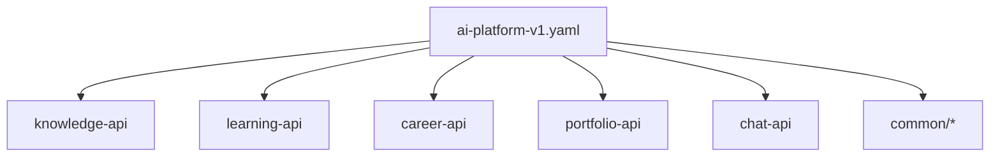

# Reusable Components

## OpenAPI components

| Location | Reuse |
| --- | --- |
| `common/security.yaml` | `bearerJwt`, `serviceApiKey`, correlation headers |
| `common/common.yaml` | Identity, envelope, AIError, ProblemDetails |
| `common/errors.yaml` | Standard HTTP problem responses |
| `common/pagination.yaml` | Page request/response (defined; unused by current operations) |
| `common/health.yaml` | HealthResponse / HealthStatus |
| Domain `*-api.yaml` | Path items + domain schemas |

## AsyncAPI components

| Location | Reuse |
| --- | --- |
| `common/common-events.yaml` | Processing lifecycle messages |
| Domain `*-events.yaml` | Channel + message definitions |

## Composition pattern

Aggregator files only `$ref` modules — authors edit domain files, not a giant monolith.

## Interview Discussion

### Why Contract First?

Reusable components encode platform standards once.

### Alternative approaches

Copy schemas per file — drift.

### Trade-offs

Deep `$ref` graphs need bundling before some tools.

### Why not shared DTO libraries?

Components are language-neutral.

### Why OpenAPI?

Component Objects are the reuse unit.

### When would you choose gRPC?

Proto `import` for shared messages.

### Scaling considerations

Lint for unused components; forbid anonymous inline duplicates in review.

### Principal API Architect interview questions

**Q1. How do you add a shared header?**  
Define in `security.yaml` / common, `$ref` from responses.

**Q2. Who may edit common/?**  
Platform owners — higher review bar than domain modules.
