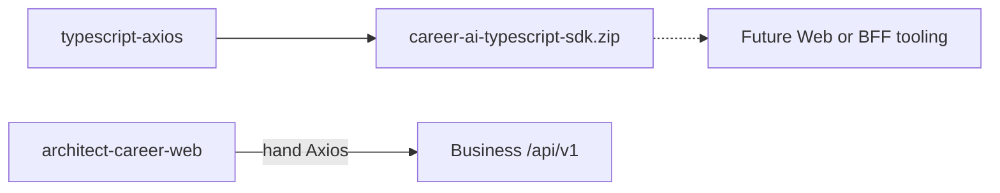

# TypeScript SDK

## What is generated

OpenAPI Generator (`generatorName: typescript-axios`) emits npm package **`@acos/ai-contracts`** under `target/generated/typescript`, packaged as `career-ai-typescript-sdk.zip`.

| Config | Value |
| --- | --- |
| `npmName` | `@acos/ai-contracts` |
| `npmVersion` | project version (1.0.0) |
| Models / APIs | Separate `models` and `api` packages |
| Client | Axios, Promises, `useSingleRequestParameter` |
| Enums | `stringEnums`, `UPPERCASE` naming |
| Interfaces | `withInterfaces: true` |

Build may patch/build TypeScript via Maven-invoked Node scripts (`scripts/maven/patch-typescript-sources.mjs`, `build-typescript.mjs`).

## Configuration & usage (intended)

Consumers would configure the Axios base path to the AI Platform URL (or a BFF) and call typed API classes. Typed models match OpenAPI schemas.

## Current Web Platform status

**Web does not consume `@acos/ai-contracts`.**  
`architect-career-web` uses hand-written Axios modules against Business Platform `/api/v1/integration/ai/**` (and never calls AI Platform directly). The TS SDK is generated and uploaded as a CI artifact for future adoption.

## Interview Discussion

### Why Contract First?

When Web adopts the SDK, types already match AI HTTP contracts—or a typed BFF can reuse the same schemas.

### Alternative approaches

Only Zod schemas in Web — still need a shared SoT for AI paths.

### Trade-offs

Generating a client nobody imports yet adds CI cost (accepted for readiness).

### Why not shared DTO libraries?

A TS-only package would not serve Java/Python.

### Why OpenAPI?

`typescript-axios` generator is a standard enterprise choice.

### When would you choose gRPC?

Browser gRPC-web — different toolchain; not chosen for ACOS AI HTTP.

### Scaling considerations

Publish to GitHub Packages npm; wire Web only if a typed client to Business BFF is generated from product OpenAPI (separate concern) or if a trusted proxy exposes AI shapes.

### Principal API Architect interview questions

**Q1. Does the browser call the AI Platform with this SDK?**  
No — architectural rule: Web → Business only; TS AI SDK unused today.

**Q2. Package name?**  
`@acos/ai-contracts`.
