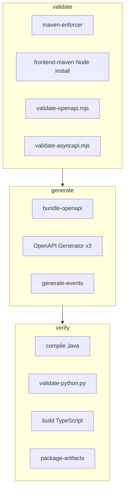

# Validation Pipeline

## Overview

Validation is layered across Maven phases so invalid contracts never produce shippable SDKs.

## OpenAPI validation

`scripts/maven/validate-openapi.mjs` (Swagger Parser):

- Validates domain modules + aggregator `openapi/ai-platform-v1.yaml`
- Fails on invalid syntax, unresolved `$ref`, invalid schemas
- Detects **duplicate `operationId`s** (local and across aggregate)
- Does not mutate sources

Additional Node lint helpers exist (`scripts/lint-openapi.mjs`) for local/npm workflows.

## AsyncAPI validation

`scripts/maven/validate-asyncapi.mjs` uses **custom structural checks** (`js-yaml`): AsyncAPI 3.x shape, channel addresses, messages, payload/headers. There is **no** Spectral, Redocly, or official `@asyncapi/cli` lint in this repo today. Spec correctness is still enforced in Maven `validate` even though no broker is wired in product repos.

## Build validation

| Gate | Role |
| --- | --- |
| Enforcer | Toolchain / environment constraints |
| Bundle | Resolves `$ref` graph to `target/bundled/openapi/` before generate |
| Generator | Fails if bundled input cannot generate |
| Java compile | Generated Feign/models must compile |
| Python script | Import/validate generated Pydantic package |
| TypeScript build | Generated client must typecheck/build |
| Artifact package | Missing JAR/ZIPs fail CI (`if-no-files-found: error`) |

## Generated code validation

Post-generate checks ensure artifacts are not empty syntax-valid packages. Hand edits under `target/` are discarded on clean builds.

## Interview Discussion

### Why Contract First?

CI fails on the YAML before consumers discover runtime 400s.

### Alternative approaches

Only runtime contract tests in Business/AI — slower feedback, multi-repo cost.

### Trade-offs

Node + Java + Python toolchain required on every contracts PR.

### Why not shared DTO libraries?

Validating three hand libraries is harder than one OpenAPI parse.

### Why OpenAPI?

Swagger Parser + generator ecosystem provide mechanical gates.

### When would you choose gRPC?

`buf lint` / breaking change detection on `.proto`.

### Scaling considerations

Add Spectral style rules and openapi-diff breaking-change checks.

### Principal API Architect interview questions

**Q1. What catches duplicate operationIds?**  
`validate-openapi.mjs` during `mvn validate`.

**Q2. Does AsyncAPI validation imply a live bus?**  
No — schema-only today.
