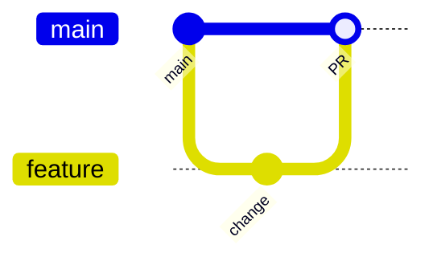

# Branching Strategy

## Observed practice

Repos use GitHub-style **main/master** as integration branches. CI on AI Platform and Contracts triggers on `main`/`master` and all PRs.

**No** CONTRIBUTING.md or enforced branch policy files (CODEOWNERS, required reviews) were found as a cross-repo standard.

## Recommended working model (aligned with current CI)

1. Feature branch from `main`  
2. PR with CI green (where workflows exist)  
3. Squash or merge to `main`  
4. Avoid long-lived release branches until multi-env CD exists

## Spotless note (Business)

`ratchetFrom>master` is **commented out** in the Business POM to avoid mass legacy reformat — implies eventual main-ratchet formatting.

## Interview Discussion

### Why this approach?

Trunk-ish PR flow matches small team and current CI triggers.

### Alternative approaches

GitFlow with develop/release. Overhead without multi-env.

### Trade-offs

Without CODEOWNERS, review quality depends on discipline.

### Enterprise adoption

Protect main; require reviews + CI; CODEOWNERS on contracts common schemas.

### Scaling considerations

Short-lived branches; stack-ranked PR size limits.

### Principal Architect interview questions

**Q1. Is GitFlow implemented?**  
Not documented or enforced — PR-to-main is the practical model.

**Q2. Do Business PRs run GitHub Actions?**  
No workflow exists; quality is local `mvn verify`.
