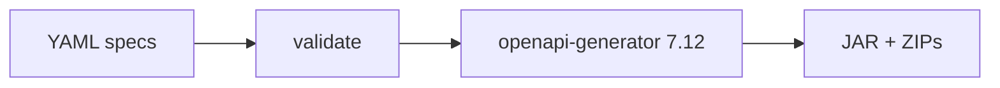

# Build Pipeline

## Business Platform

Primary gate: **`mvn clean verify`** (`pom.xml` `0.0.1`, Java 21, Spring Boot 3.5.16).

| Phase / plugin | Role |
| --- | --- |
| Enforcer 3.5.0 | Maven ≥3.8, Java `[21,22)`, dependency convergence |
| Spotless 2.44.5 | google-java-format GOOGLE @ `validate` |
| Checkstyle 10.23.1 | `config/checkstyle/checkstyle.xml` @ `verify` |
| PMD 3.26.0 | ruleset + CPD (`minimumTokens=150`) |
| SpotBugs 4.9.3 | Max effort, Medium threshold |
| JaCoCo 0.8.13 | report + check — **COVEREDRATIO min 0.00** (gate present, not enforcing) |
| Surefire / Failsafe | unit `*Test`; IT `*IT` / `*IntegrationTest` |

Run: `mvn spring-boot:run` (port **8080**).

## Web Platform

| Script | Purpose |
| --- | --- |
| `npm run build` | `tsc -b && vite build` → `dist/` |
| `lint` / `format:check` / `typecheck` | ESLint 9, Prettier, TypeScript |
| `test` / `test:e2e` | Vitest / Playwright |

Node engines: `>=20`. No remote build artifact publish.

## AI Platform

Local/CI: `pip install -e ".[dev]"` (+ vendored contracts), then ruff/black/mypy/pytest. Image build via root `Dockerfile` (Python 3.13-slim, uvicorn **8090**).

## AI Contracts

`mvn clean verify`: validate OpenAPI/AsyncAPI → bundle → generate Java/Python/TS → compile/validate → package `target/artifacts/career-ai-*-sdk.*`.

## Interview Discussion

### Why this approach?

Each stack uses native build tools; quality plugins fail the build early.

### Alternative approaches

Gradle; Nx monorepo. Maven/npm/pip match team skills.

### Trade-offs

Four build systems; no single green-pipeline dashboard.

### Enterprise adoption

Wrap each in the same CI contract: lint → test → package → scan.

### Scaling considerations

Remote build cache; parallel modules when Business grows.

### Principal Architect interview questions

**Q1. What is Business JaCoCo minimum?**  
0.00 — coverage tool wired without an enforcing bar.

**Q2. AI Platform coverage gate?**  
pytest `--cov-fail-under=55` in CI.
