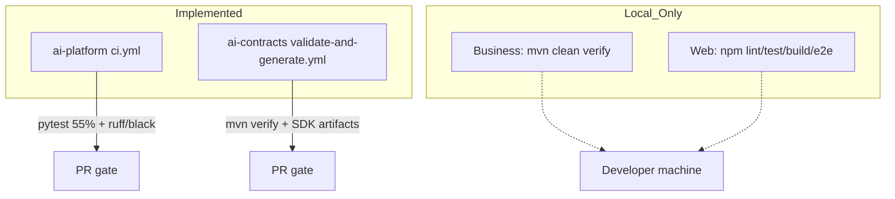

# CI/CD Architecture

## Current state

ACOS does **not** yet have a unified multi-repo CD platform. Continuous integration exists where workflows are checked in; Business and Web rely on **local** quality gates.

## GitHub Actions (implemented)

### AI Platform — `.github/workflows/ci.yml`

| Aspect | Detail |
| --- | --- |
| Triggers | push `main`/`master`, PR, `workflow_dispatch` |
| Job `verify` | Python 3.13: ruff, black, mypy (soft), pytest `--cov-fail-under=55`, contract compatibility script, pip-audit/bandit (soft) |
| Job `container-scan` | `docker build` + Trivy CRITICAL/HIGH (soft fail) |

### AI Contracts — `.github/workflows/validate-and-generate.yml`

| Aspect | Detail |
| --- | --- |
| Triggers | push `main`/`master`, PR, `workflow_dispatch` |
| Core | Java 21 + Python 3.12 + `mvn -B clean verify` |
| Artifacts | Upload JAR + Python/TS ZIPs as `career-ai-sdk-artifacts` |
| Publish | `mvn deploy` to GitHub Packages **commented out** |

## Not implemented

- Business Platform / Web Platform GitHub Actions
- Cross-repo release orchestration
- Automated deploy to cloud environments
- Required status checks across all four repos

## Interview Discussion

### Why this approach?

CI is introduced first where generation and multi-language AI risk are highest (contracts + AI).

### Alternative approaches

Monorepo single pipeline; or GitLab CI. Separate repos keep stack-native tooling.

### Trade-offs

Uneven CI maturity across repos; Business/Web regressions can slip without remote gates.

### Enterprise adoption

Standardize required checks before production; keep language-native jobs.

### Scaling considerations

Reusable workflow templates; path filters; matrix Python/Node versions.

### Principal Architect interview questions

**Q1. Which repos have GitHub Actions today?**  
AI Platform and AI Contracts only.

**Q2. Does contracts CI publish to Maven Central?**  
No — uploads Actions artifacts; Packages deploy is stubbed.
