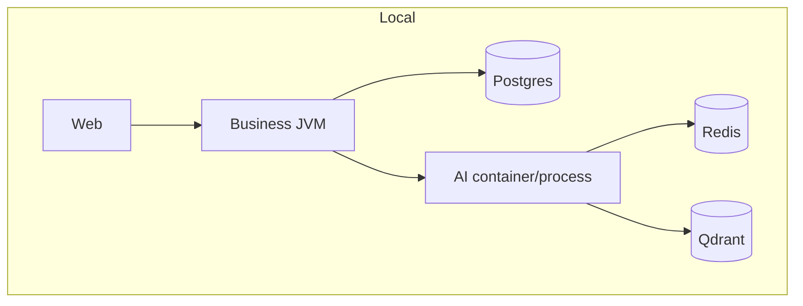

# Deployment Architecture

## Implemented deployment model

**Local multi-process deployment** for demos and development:

1. Start Postgres (Business compose)  
2. Run Business on **8080**  
3. Run Web Vite on **5173** (or serve `dist` on **4173** preview)  
4. Optionally start AI stack on **8090** + Redis/Qdrant  
5. Enable `ai.platform.enabled=true` on Business when integrating

## Health / readiness (for orchestration later)

| System | Endpoints |
| --- | --- |
| Business | Actuator `/actuator/health`, readiness group `db`+`aiPlatform`, liveness |
| AI | `/api/v1/system/liveness`, `/readiness`, `/api/v1/ai/health`, `/metrics` |

## Not implemented

- Kubernetes manifests / Helm  
- Cloud load balancers / ingress TLS  
- Blue-green / canary  
- Central secret injection at deploy time

## Interview Discussion

### Why this approach?

Prove architecture with local deploy before cloud complexity.

### Alternative approaches

PaaS (Railway/Fly) early. Less portable teaching artifact.

### Trade-offs

No prod deploy runbook beyond local/manual.

### Enterprise adoption

Add images + Helm when environments exist.

### Scaling considerations

HPA on AI CPU/GPU; Business on RPS + DB pool.

### Principal Architect interview questions

**Q1. Is there a Helm chart?**  
No.

**Q2. Can readiness include AI from Business?**  
Yes — readiness group includes `aiPlatform` indicator.
