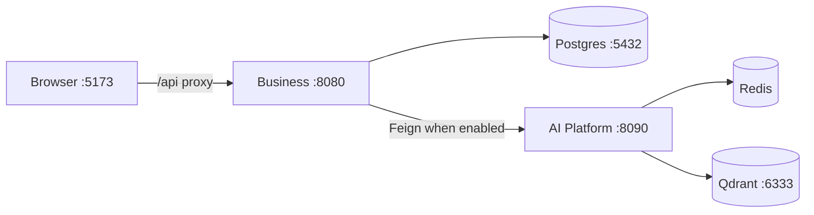

# Infrastructure Overview

## Runtime topology (local / demo)

| Component | How provided |
| --- | --- |
| PostgreSQL 17.5 | Business `infrastructure/docker/docker-compose.yml` |
| pgAdmin | Same compose (optional) |
| Redis 7 | AI `docker-compose.yml` / `.dev.yml` |
| Qdrant v1.12.5 | AI compose |
| Business app | JVM process (`spring-boot:run`) — **no app Dockerfile** |
| Web app | Vite dev / static `dist/` — **no Dockerfile** |
| AI app | Dockerfile + compose service |

## Networking

- Web proxies `/api` → `VITE_API_PROXY_TARGET` (default `http://localhost:8080`)
- Browser never calls AI directly
- AI default host `0.0.0.0:8090`

## Future Roadmap

Kubernetes / Helm, shared ingress, managed Postgres/Redis/Qdrant, otel-collector service (hostname referenced in AI compose but **not defined**).

## Interview Discussion

### Why this approach?

Compose for data plane; process run for apps keeps local DX simple.

### Alternative approaches

Full dockerize everything day one. Heavier for Java hot-reload.

### Trade-offs

Prod parity incomplete without Business/Web images.

### Enterprise adoption

Containerize all apps before K8s.

### Scaling considerations

Managed services replace local volumes.

### Principal Architect interview questions

**Q1. Is Business containerized?**  
No — only Postgres/pgAdmin in compose.

**Q2. Who owns Redis?**  
AI Platform compose/runtime.
