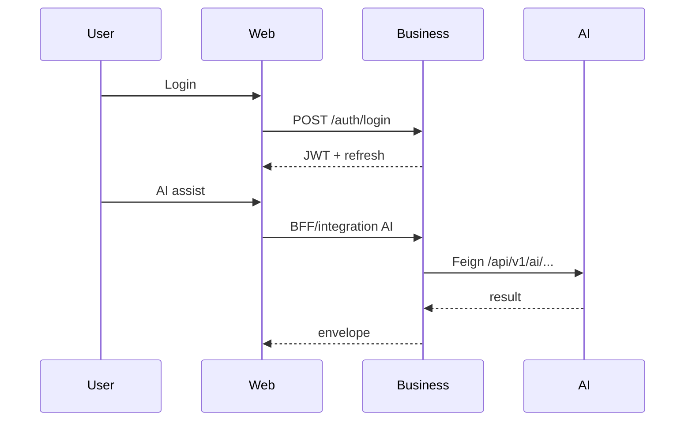

# System Design Interview Guide

## 45-minute board sketch

1. Actors: User ↔ Web ↔ Business ↔ Postgres  
2. Optional: Business ↔ AI ↔ Redis/Qdrant/LLM  
3. Contracts repo feeds AI models (+ future SDKs)  
4. Cross-cutting: JWT, correlation IDs, health/metrics  

## Deep dives to practice

- Auth refresh rotation  
- Resilience4j around Feign  
- RAG index-on-write vs search path  
- Failure mode: AI down, Business CRUD up  

## What not to invent

Kubernetes mesh, Kafka already running, Web→AI direct, 99.99% SLO claims.

## Interview Discussion

### Why this approach?

Design interviews score you on constraints and failure modes.

### Alternative approaches

Pattern bingo without ACOS facts. Weak.

### Trade-offs

Must know which Web AI BFF pieces are missing.

### Enterprise adoption

Add capacity & threat slides.

### Scaling considerations

Discuss read vs write paths separately.

### Principal Architect interview questions

**Q1. Where does chat completion live?**  
AI Platform OpenAPI; Business Chat Feign not present yet.

**Q2. Session state store?**  
JWT access + DB refresh tokens — not server HTTP sessions.
