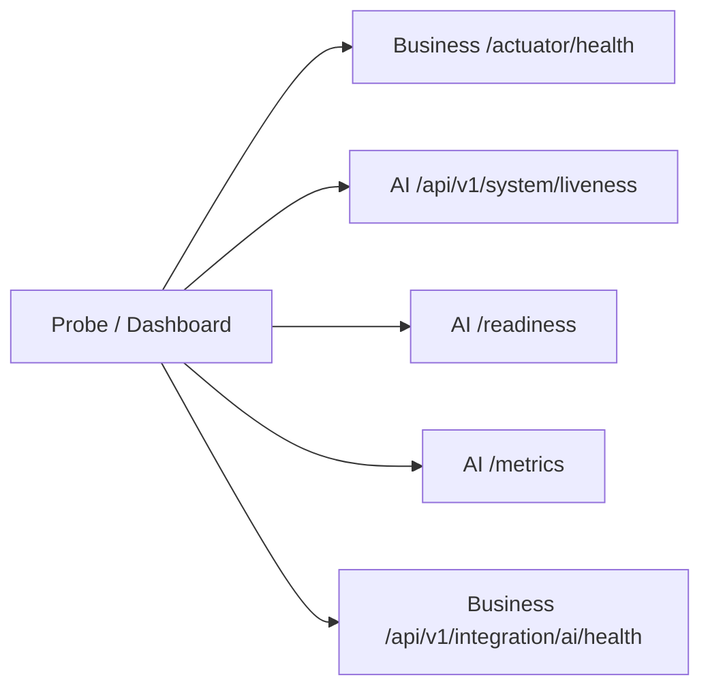

# Monitoring

## Health endpoints to scrape / probe

| Check | Auth notes |
| --- | --- |
| Business Actuator health/info | PermitAll for health/info |
| Business AI integration health REST | JWT required |
| AI liveness | Open (rate-limit exempt) |
| AI readiness | Includes redis/qdrant when enabled |

## Current monitoring practice

Manual inspection of Actuator + Prometheus endpoints during local runs. **No** Prometheus server, Grafana, or Alertmanager checked into the ecosystem.

## Interview Discussion

### Why this approach?

Expose standards-based health/metrics before installing a full observability stack.

### Alternative approaches

SaaS APM only. Fine later.

### Trade-offs

No always-on monitoring in demo topology.

### Enterprise adoption

Prometheus Operator + Grafana; synthetic probes.

### Scaling considerations

Multi-cluster federation.

### Principal Architect interview questions

**Q1. Readiness components on Business?**  
`readinessState`, `db`, `aiPlatform`.

**Q2. Is Grafana included?**  
No.
