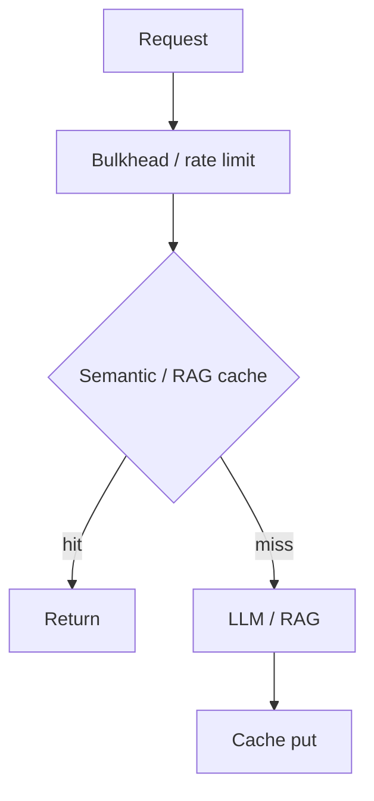

# Performance Architecture

## Business

- HikariCP pool (local): max 10, min idle 2  
- Async AI indexing executor: core 2 / max 8 / queue 500  
- Resilience4j TimeLimiter 30s; Bulkhead max 20 concurrent AI calls  
- No application-level cache (no Redis/Caffeine on Business)  

## Web

- Route-level code splitting (`lazyNamed`)  
- Manual vendor chunks (MUI, query, charts, markdown, router)  
- Sidebar route prefetch on hover/focus  
- PWA caching for fonts/images; **NetworkOnly** for `/api/`  

## AI

- Redis RAG cache + semantic cache (similarity threshold default 0.92)  
- Bulkhead 64; retries/timeouts/circuit in enterprise pipeline  
- In-memory rate limit 120/min  
- Optional Qdrant vector search  

## Interview Discussion

### Why this approach?

Protect AI cost/latency with caches and bulkheads; keep Business transactional path simple.

### Alternative approaches

Cache everything in Business. Wrong place for AI semantics.

### Trade-offs

Semantic cache similarity index is process-local (see Caching).

### Enterprise adoption

CDN for Web assets; read replicas for Postgres.

### Scaling considerations

Horizontal AI replicas behind LB; shared Redis.

### Principal Architect interview questions

**Q1. Business cache?**  
None implemented.

**Q2. Web API caching in SW?**  
NetworkOnly for `/api/`.
