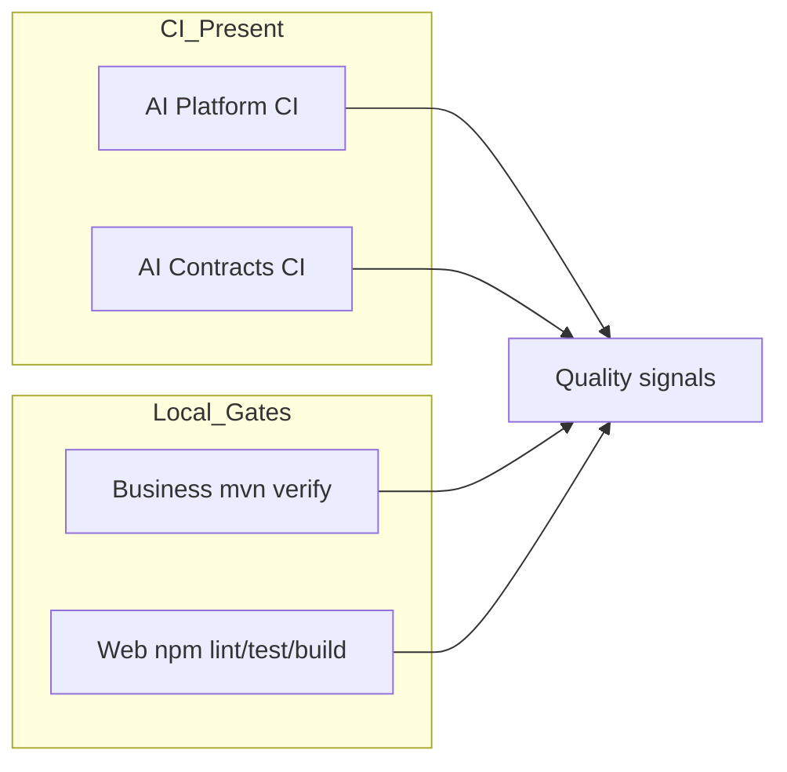

# Engineering Excellence Handbook

Chapter 08 consolidates how ACOS is **built, operated, secured, observed, tested, and evolved** across:

| Repository | Role |
| --- | --- |
| `architect-career-operating-system` | Business Platform (Java 21 / Spring Boot 3.5) |
| `architect-career-web` | Web Platform (React 19 / Vite 6) |
| `architect-career-ai-platform` | AI Platform (Python 3.13 / FastAPI) |
| `architect-career-ai-contracts` | AI Contracts (OpenAPI 3.1 / AsyncAPI 3.0) |

**Integrity rule:** only implemented pipelines, configs, and code paths are described as current. Gaps belong in [Roadmap/](Roadmap/) and per-section Future notes.

Audience: Principal Architects, Enterprise Architects, Engineering Managers, Platform Engineers, DevSecOps, SREs, senior developers.

---

## Document map

### DevOps
- [CI-CD-Architecture.md](DevOps/CI-CD-Architecture.md)
- [Build-Pipeline.md](DevOps/Build-Pipeline.md)
- [Release-Management.md](DevOps/Release-Management.md)
- [Versioning.md](DevOps/Versioning.md)
- [Branching-Strategy.md](DevOps/Branching-Strategy.md)

### Infrastructure
- [Infrastructure-Overview.md](Infrastructure/Infrastructure-Overview.md)
- [Docker.md](Infrastructure/Docker.md)
- [Deployment-Architecture.md](Infrastructure/Deployment-Architecture.md)
- [Environment-Management.md](Infrastructure/Environment-Management.md)
- [Configuration-Management.md](Infrastructure/Configuration-Management.md)

### Security
- [Security-Architecture.md](Security/Security-Architecture.md)
- [Authentication.md](Security/Authentication.md)
- [Authorization.md](Security/Authorization.md)
- [Secret-Management.md](Security/Secret-Management.md)
- [AI-Security.md](Security/AI-Security.md)
- [Threat-Model.md](Security/Threat-Model.md)

### Observability
- [Logging.md](Observability/Logging.md)
- [Metrics.md](Observability/Metrics.md)
- [Distributed-Tracing.md](Observability/Distributed-Tracing.md)
- [Monitoring.md](Observability/Monitoring.md)
- [Alerting.md](Observability/Alerting.md)

### Performance
- [Performance-Architecture.md](Performance/Performance-Architecture.md)
- [Scalability.md](Performance/Scalability.md)
- [Capacity-Planning.md](Performance/Capacity-Planning.md)
- [Caching.md](Performance/Caching.md)
- [Database-Optimization.md](Performance/Database-Optimization.md)

### Testing
- [Testing-Strategy.md](Testing/Testing-Strategy.md)
- [Test-Pyramid.md](Testing/Test-Pyramid.md)
- [Integration-Testing.md](Testing/Integration-Testing.md)
- [AI-Testing.md](Testing/AI-Testing.md)
- [Performance-Testing.md](Testing/Performance-Testing.md)

### Runbooks
- [Local-Development.md](Runbooks/Local-Development.md)
- [Local-Setup.md](Runbooks/Local-Setup.md)
- [Deployment.md](Runbooks/Deployment.md)
- [Troubleshooting.md](Runbooks/Troubleshooting.md)
- [Incident-Response.md](Runbooks/Incident-Response.md)
- [Disaster-Recovery.md](Runbooks/Disaster-Recovery.md)

### Governance
- [Coding-Standards.md](Governance/Coding-Standards.md)
- [Review-Checklist.md](Governance/Review-Checklist.md)
- [Architecture-Governance.md](Governance/Architecture-Governance.md)
- [API-Governance.md](Governance/API-Governance.md)
- [AI-Governance.md](Governance/AI-Governance.md)

### Interview / Lessons / Roadmap / Demo
- [Interview-Guide/](Interview-Guide/) · [Lessons-Learned/](Lessons-Learned/) · [Roadmap/](Roadmap/) · [Demo/](Demo/)

---

## Ecosystem quality posture (honest)

| Repo | Remote CI | Container image | Registry publish |
| --- | --- | --- | --- |
| Business | **None** — local `mvn verify` | Postgres compose only | No |
| Web | **None** — local npm scripts | No Dockerfile | No |
| AI Platform | GitHub Actions `ci.yml` | Dockerfile + compose | No registry push |
| AI Contracts | GitHub Actions validate/generate | N/A | Artifact upload; Packages **stubbed** |

Return to portfolio home: [../README.md](../README.md)
