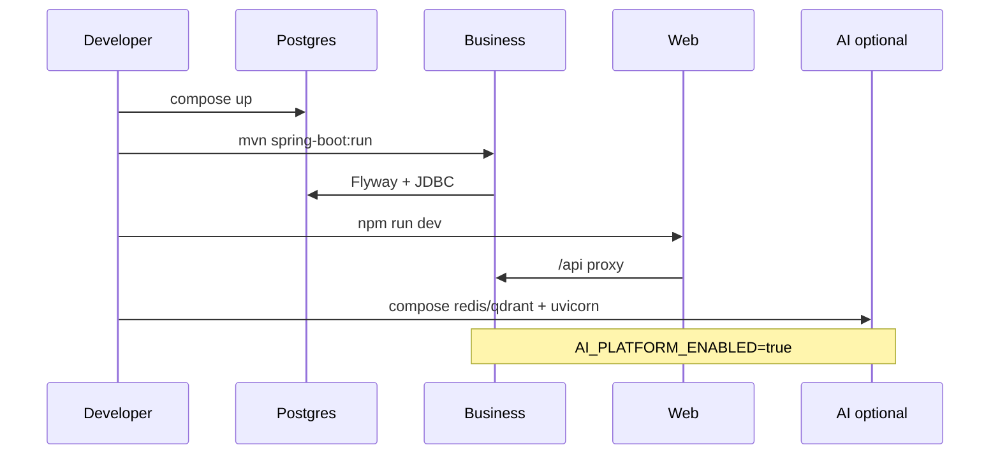

# Local Development

## Purpose

Define the daily developer loop across ACOS repositories without claiming a unified monorepo DX.

## Scope

Applies to local machines running Java 21, Node 20+, Python 3.13, and Docker. Does not cover cloud sandboxes (**Future enhancement**).

## Audience

- Developer
- Platform Engineer

## Preconditions

### Required tools
- Java 21, Maven 3.8+
- Node.js ≥ 20, npm
- Python 3.13 (+ 3.12 acceptable for contracts CI parity)
- Docker Desktop / Engine

### Permissions
- Ability to bind ports `5173`, `8080`, `8090`, `5432`, `6379`, `6333`, `5050`

### Environment
- Sibling checkout recommended:
  - `architect-career-operating-system`
  - `architect-career-web`
  - `architect-career-ai-platform`
  - `architect-career-ai-contracts`

## Step-by-Step Procedure

1. **Start Postgres** (Business data plane):
   ```bash
   cd architect-career-operating-system/infrastructure/docker
   docker compose up -d
   docker compose ps
   ```
   Expected: `postgres` healthy; optional `pgadmin` on `5050`.

2. **Align DB credentials** — compose defaults `acos`/`acos`/`acos`; Spring local defaults often `postgres`/`postgres`. Set before Boot:
   ```bash
   # PowerShell example
   $env:ACOS_DB_USER="acos"; $env:ACOS_DB_PASSWORD="acos"; $env:ACOS_DB_NAME="acos"
   ```

3. **Run Business Platform**:
   ```bash
   cd architect-career-operating-system
   mvn spring-boot:run
   ```
   Expected: listening on `http://localhost:8080`; Flyway applies `V1`–`V12`.

4. **Run Web Platform**:
   ```bash
   cd architect-career-web
   npm install
   npm run dev
   ```
   Expected: `http://localhost:5173` proxies `/api` → `http://localhost:8080`.

5. **Optional — AI stack**:
   ```bash
   cd architect-career-ai-platform
   docker compose -f docker-compose.dev.yml up -d redis qdrant
   # set REDIS_URL=redis://localhost:6379/0 (settings default :6380 — override!)
   pip install -e ".[dev]"
   uvicorn app.main:app --reload --host 0.0.0.0 --port 8090
   ```

6. **Optional — enable AI from Business**:
   ```bash
   $env:AI_PLATFORM_ENABLED="true"
   $env:AI_PLATFORM_BASE_URL="http://localhost:8090"
   # restart Business
   ```

7. **Quality before push** (repo-local):
   - Business: `mvn verify`
   - Web: `npm run lint && npm test && npm run build`
   - AI: `ruff check app tests && black --check app tests && pytest -q`
   - Contracts (if changed): `mvn clean verify` then AI `python scripts/sync_contracts.py`

## Validation

| Check | Command / URL | Expect |
| --- | --- | --- |
| Postgres | `docker compose exec postgres pg_isready -U acos` | accept connections |
| Business health | `GET http://localhost:8080/actuator/health` | UP / components present |
| Web | Open `http://localhost:5173` | login/register renders |
| AI liveness | `GET http://localhost:8090/api/v1/system/liveness` | `{"status":"UP"}` |
| Login smoke | `POST /api/v1/auth/register` then `/login` via Web or HTTP client | tokens issued |

## Rollback

Stop processes (`Ctrl+C`). Leave Docker volumes intact unless resetting data. To disable AI without teardown: set `AI_PLATFORM_ENABLED=false` and restart Business.

## Troubleshooting

| Issue | Cause | Fix |
| --- | --- | --- |
| Boot fails on datasource | DB user mismatch | Align `ACOS_DB_*` with compose |
| Web 502/ECONNREFUSED | Business down / wrong proxy | Check `:8080`; `VITE_API_PROXY_TARGET` |
| AI Redis errors | URL on `:6380` | Export `REDIS_URL=redis://localhost:6379/0` |
| Feign failures with AI “on” | AI not up | Start AI or disable flag |

## Escalation

Escalate to Platform Engineer if Flyway checksum failures appear on a shared database volume or if multiple developers corrupt the same Docker volume.

## References

- [Environment-Setup.md](Environment-Setup.md)
- [../../Infrastructure/Docker.md](../../Infrastructure/Docker.md)
- Showcase Quick Start in root `README.md`
- Repos: all four ACOS repositories

### Diagram — repository startup order


