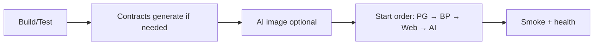

# Deployment

## Purpose

Deploy (start) a coherent ACOS stack for local/demo operation using implemented build and compose paths.

## Scope

Local multi-process deployment. **Not** Kubernetes, cloud CD, or registry promotion — those are **Future enhancements**.

## Audience

- DevOps Engineer
- Platform Engineer
- SRE
- Developer

## Preconditions

- Green local builds for components you will run
- Docker for data plane (+ AI image if used)
- Secrets chosen for the target environment (never commit)

## Step-by-Step Procedure

### Deployment workflow



1. **Build & test**
   - Contracts (if API changed): `mvn -B clean verify`
   - Business: `mvn clean verify` (or `package`)
   - Web: `npm run build` (and `npm test` / lint as required)
   - AI: CI-equivalent `ruff`/`black`/`pytest` locally; optional `docker build -t acos-ai-platform:local .`

2. **Generate / sync contracts** (AI consumers)
   ```bash
   cd architect-career-ai-contracts && mvn clean verify -Ppython
   cd ../architect-career-ai-platform
   python scripts/sync_contracts.py
   pip install -e ./third_party/acos_ai_contracts
   ```

3. **Data plane**
   ```bash
   cd architect-career-operating-system/infrastructure/docker && docker compose up -d
   ```

4. **Business**
   ```bash
   cd architect-career-operating-system
   # set ACOS_DB_* and ACOS_JWT_SECRET
   java -jar target/*.jar
   # or: mvn spring-boot:run
   ```

5. **Web**
   ```bash
   cd architect-career-web
   npm run build && npm run preview
   # or npm run dev for interactive demos
   ```
   Ensure `VITE_API_BASE_URL` / proxy targets the Business URL.

6. **AI (optional)**
   ```bash
   cd architect-career-ai-platform
   docker compose up -d --build
   # or uvicorn on host with REDIS_URL override
   ```

7. **Enable integration** only after AI liveness is UP: `AI_PLATFORM_ENABLED=true`.

8. **Smoke tests**
   - Register/login via Web
   - `GET /actuator/health/readiness`
   - If AI on: `GET /api/v1/integration/ai/health` + AI `/api/v1/system/readiness`

## Validation

All targeted health endpoints success; critical user journey (auth + one domain CRUD) works; AI assist only if intentionally enabled.

## Rollback

See [Rollback.md](Rollback.md). Immediate mitigation for AI blast radius: set `AI_PLATFORM_ENABLED=false` and restart Business.

## Troubleshooting

| Failure | Action |
| --- | --- |
| Jar missing | Run `mvn package` |
| Flyway fail | Fix DB URL/creds; inspect migration |
| Web static 404 API | Misconfigured `VITE_API_BASE_URL` for preview mode |
| AI container unhealthy | `docker logs`; check liveness curl inside healthcheck |

## Escalation

Escalate if deployment requires shared environment credentials or customer data — define ownership before proceeding.

## References

- [Release-Checklist.md](Release-Checklist.md)
- [../03-monitoring/Health-Checks.md](../03-monitoring/Health-Checks.md)
- [../../DevOps/CI-CD-Architecture.md](../../DevOps/CI-CD-Architecture.md)
- **Future enhancement:** GitHub Environments + image registries + K8s manifests
