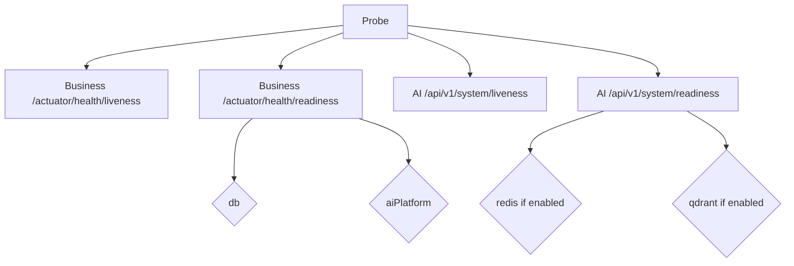

# Health Checks

## Purpose

Operate and interpret liveness/readiness endpoints across Business and AI platforms.

## Scope

Implemented Actuator and FastAPI system routes. No Prometheus Alertmanager wiring (**Future enhancement**).

## Audience

- SRE
- DevOps Engineer
- Platform Engineer
- Developer

## Preconditions

- Stack partially or fully running
- curl or browser

## Step-by-Step Procedure

### Health check flow



1. **Business**
   ```bash
   curl -s http://localhost:8080/actuator/health
   curl -s http://localhost:8080/actuator/health/liveness
   curl -s http://localhost:8080/actuator/health/readiness
   ```
   - Readiness includes `db` + `aiPlatform` (+ readinessState)
   - JWT-protected: `GET /api/v1/integration/ai/health`

2. **AI**
   ```bash
   curl -s http://localhost:8090/api/v1/system/liveness
   curl -s http://localhost:8090/api/v1/system/readiness
   curl -s http://localhost:8090/api/v1/ai/health
   ```
   - Docker HEALTHCHECK uses liveness URL

3. **Postgres compose**
   ```bash
   docker compose exec postgres pg_isready -U acos
   ```

4. **Interpretation**
   - Liveness fail → process broken → restart
   - Readiness fail with AI down → dependency issue; consider disabling AI flag rather than killing Business

## Validation

Documented endpoints return expected JSON; probes match orchestration intent (liveness ≠ dependency).

## Rollback

N/A — read-only. If probing storms an env, stop scripts.

## Troubleshooting

| Observation | Meaning |
| --- | --- |
| readiness DOWN `db` | Postgres/creds |
| readiness DOWN `aiPlatform` | AI down or flag/network |
| AI readiness NOT_READY | Redis/Qdrant when enabled |

## Escalation

Escalate when health flaps without deploy — possible resource exhaustion.

## References

- [../../Observability/Monitoring.md](../../Observability/Monitoring.md)
- Business `application.yml` Actuator config
- AI Dockerfile HEALTHCHECK
