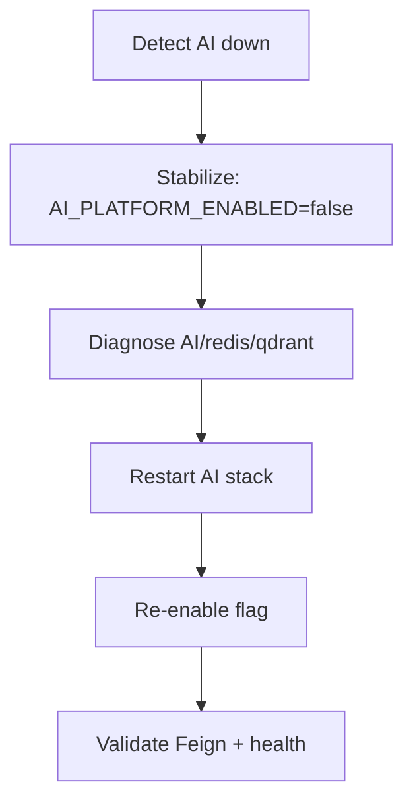

# Incident: AI Platform Down

## Purpose

Restore AI assist capability or safely degrade Business to CRUD-only mode.

## Scope

AI process/container on port 8090. Business should remain available if flag/resilience behave correctly.

## Audience

- SRE
- DevOps Engineer
- Platform Engineer
- Developer
- Architect

## Preconditions

- Access to process logs and health endpoints
- Ability to change env flags and restart services
- Docker CLI if dependencies are containerized

## Symptoms

- Feign timeouts/errors; CB open metrics
- `/api/v1/system/liveness` fails
- Business readiness `aiPlatform` component DOWN
- AI features empty/fallback messages

## Detection

- Actuator readiness / `AiPlatformMetrics` timeouts
- Integration health API failures
- Docker healthcheck failing on AI container

## Diagnosis

1. curl liveness/readiness/metrics on `:8090`
2. `docker ps` / `docker logs` for ai-platform, redis, qdrant
3. Confirm Business `AI_PLATFORM_BASE_URL`
4. Distinguish: process down vs dependency NOT_READY vs rate limit 429 vs auth 401
5. Check provider keys only if LLM-specific failures (see OpenAI-Outage)

## Step-by-Step Procedure (Recovery)

### Incident response flow

1. **Stabilize (mandatory first if users impacted):** set `AI_PLATFORM_ENABLED=false`, restart Business — CRUD continues
2. Restart AI: compose `up -d` or uvicorn
3. Fix Redis URL (`6379` vs default `6380`), Qdrant URL, auth flags
4. When liveness UP and readiness acceptable, re-enable flag
5. Smoke one AI path via Business facade

## Validation

- AI liveness UP
- Optional readiness READY
- Business integration AI health OK with JWT
- No sustained CB open

## Rollback

If recovery introduces worse failure, revert to last known-good env/git SHA and keep Business in CRUD-only mode (`AI_PLATFORM_ENABLED=false`) when AI is involved.

## Prevention

- Default AI flag false in non-demo envs
- Bulkhead/timeouts already configured — keep them
- Healthchecks in compose/Dockerfile

## Troubleshooting

| Case | Action |
| --- | --- |
| Liveness down | Process/image crash — logs |
| Readiness NOT_READY | Redis/Qdrant |
| Business timeouts only | Network/URL/firewall |

## Escalation

Escalate to AI Architect/Platform Engineer for repeated pipeline faults; keep Business degraded until resolved.

## References

- [../../Security/AI-Security.md](../../Security/AI-Security.md)
- Chapter 06
- Resilience4j config on Business
