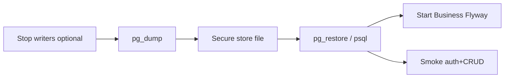

# Backup and Restore

## Purpose

Manually backup and restore Postgres (and optionally Qdrant volumes) for local/demo DR drills.

## Scope

Operator-driven `pg_dump`/`pg_restore`. **No automated backup job** in-repo (**Future enhancement**).

## Audience

- SRE
- DevOps Engineer
- Platform Engineer

## Preconditions

- Postgres running
- Disk space for dumps
- Business stopped or read-only during restore

## Step-by-Step Procedure

### Backup & restore workflow



1. **Backup Postgres**
   ```bash
   docker compose exec -T postgres pg_dump -U acos -d acos -Fc > acos-$(date +%Y%m%d).dump
   ```

2. **Backup Qdrant (optional)** — stop qdrant; copy Docker volume `qdrant_data`; or accept re-index from Postgres SoR.

3. **Restore Postgres**
   ```bash
   # drop/recreate DB carefully in non-prod
   docker compose exec -T postgres pg_restore -U acos -d acos --clean --if-exists < acos-YYYYMMDD.dump
   ```

4. Start Business; confirm Flyway history coherent.

5. Re-index AI knowledge if vectors stale.

## Validation

- Row counts / login work
- Flyway history matches expectations
- AI search only after re-index if applicable

## Rollback

Keep the pre-restore dump; restore that if the new restore fails.

## Troubleshooting

| Issue | Fix |
| --- | --- |
| Version skew pg_dump | Use matching client/server major |
| Permission denied | Align `-U` roles |

## Escalation

Escalate production-like restores needing RPO commitments — not defined today.

## References

- [Disaster-Recovery.md](Disaster-Recovery.md)
- [../../Infrastructure/Docker.md](../../Infrastructure/Docker.md)
