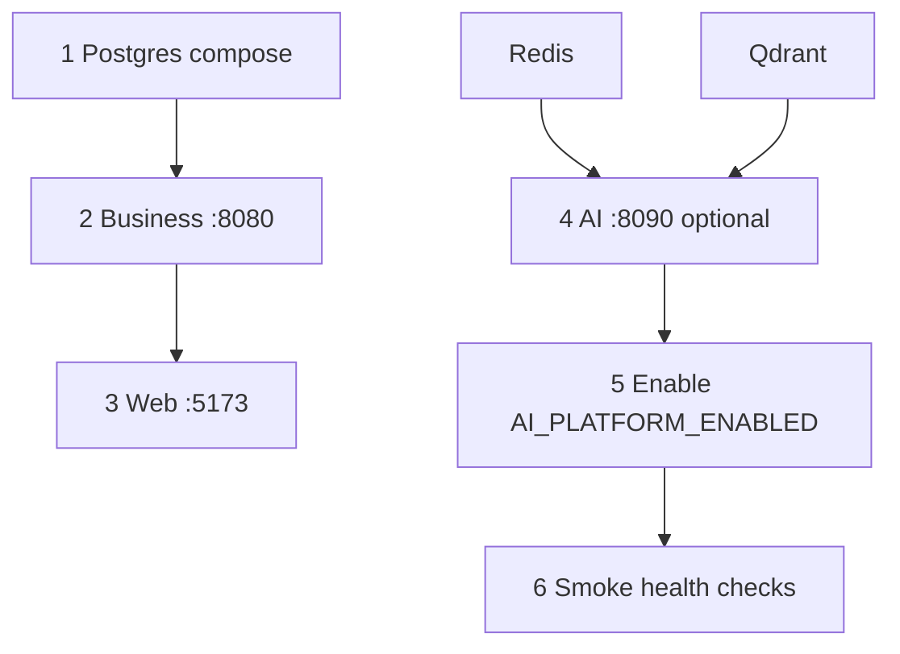
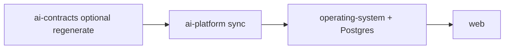

# Operations Handbook (Runbooks)

Enterprise operational procedures for the ACOS ecosystem. These runbooks describe **what another engineer can do today** against the four repositories. Cloud CD, Kubernetes, automated backups, and GitHub Packages publish are **not** implemented—called out as **Future enhancement** where relevant.

## Integrity rule

> If a step cannot be executed with current compose files, Maven/npm/pip scripts, health endpoints, or CI workflows, it is labeled **Future enhancement**.

## Handbook map

### 01 — Developer
| Runbook | Use when |
| --- | --- |
| [Local-Development.md](01-developer/Local-Development.md) | Day-to-day coding loop |
| [Environment-Setup.md](01-developer/Environment-Setup.md) | First-time machine / repo bring-up |
| [Debugging.md](01-developer/Debugging.md) | Cross-service debug with correlation IDs |
| [Database-Migrations.md](01-developer/Database-Migrations.md) | Flyway changes on Business Platform |

### 02 — Operations
| Runbook | Use when |
| --- | --- |
| [Deployment.md](02-operations/Deployment.md) | Build and start a demo/local “release” |
| [Rollback.md](02-operations/Rollback.md) | Undo a bad deploy or config change |
| [Release-Checklist.md](02-operations/Release-Checklist.md) | Pre-merge / pre-demo gate |
| [Secret-Rotation.md](02-operations/Secret-Rotation.md) | Rotate JWT / API keys / DB passwords |

### 03 — Monitoring
| Runbook | Use when |
| --- | --- |
| [Health-Checks.md](03-monitoring/Health-Checks.md) | Probe liveness/readiness |
| [Logging.md](03-monitoring/Logging.md) | Find and correlate logs |
| [Metrics.md](03-monitoring/Metrics.md) | Scrape Prometheus endpoints |
| [Distributed-Tracing.md](03-monitoring/Distributed-Tracing.md) | Correlation / OTel / LangFuse reality |

### 04 — Incident response
| Runbook | Use when |
| --- | --- |
| [Spring-Boot-Down.md](04-incident-response/Spring-Boot-Down.md) | Business Platform unavailable |
| [AI-Platform-Down.md](04-incident-response/AI-Platform-Down.md) | AI Platform unavailable |
| [PostgreSQL-Down.md](04-incident-response/PostgreSQL-Down.md) | Postgres unavailable |
| [Redis-Down.md](04-incident-response/Redis-Down.md) | Redis unavailable |
| [Qdrant-Down.md](04-incident-response/Qdrant-Down.md) | Qdrant unavailable |
| [OpenAI-Outage.md](04-incident-response/OpenAI-Outage.md) | LLM provider outage |

### 05 — Maintenance
| Runbook | Use when |
| --- | --- |
| [Dependency-Upgrades.md](05-maintenance/Dependency-Upgrades.md) | Bump Maven/npm/pip deps |
| [Database-Maintenance.md](05-maintenance/Database-Maintenance.md) | Postgres operational care |
| [Backup-Restore.md](05-maintenance/Backup-Restore.md) | Manual dump/restore |
| [Disaster-Recovery.md](05-maintenance/Disaster-Recovery.md) | Rebuild from empty state |

### 06 — Checklists
| Checklist | Use when |
| --- | --- |
| [Production-Readiness.md](06-checklists/Production-Readiness.md) | Before calling an env “prod” |
| [Release-Readiness.md](06-checklists/Release-Readiness.md) | Before a release/demo cut |
| [Security-Checklist.md](06-checklists/Security-Checklist.md) | Security review |
| [Performance-Checklist.md](06-checklists/Performance-Checklist.md) | Perf review |
| [Architecture-Checklist.md](06-checklists/Architecture-Checklist.md) | Architecture / boundary review |

## Startup sequence (current implementation)

## Repository startup order

Parent handbook: [../README.md](../README.md)
