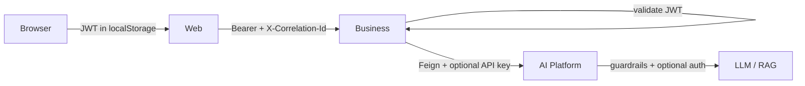

# Security Architecture

## Trust boundaries

| Boundary | Control (implemented) |
| --- | --- |
| User → Web | SPA; no AI keys in browser |
| Web → Business | Access JWT; refresh rotation; 401 refresh interceptor |
| Business APIs | Spring Security filter chain; BCrypt passwords |
| Business → AI | Feature flag; Resilience4j; outbound auth headers |
| AI ingress | Optional JWT / API key / internal service token |
| AI execution | Heuristic guardrails, sanitizer, data masker, rate limit |

## Defense layers

1. **Network intent:** Web never calls AI Platform  
2. **AuthN:** JWT access + opaque refresh (Business); optional multi-mode auth (AI)  
3. **AuthZ:** authenticated-by-default Business APIs; Web `ProtectedRoute` (roles prop exists, unused in routes)  
4. **Input:** password policy; Bean Validation / Zod; AI guardrails  
5. **Supply chain:** AI CI pip-audit, bandit, Trivy (soft); Business SpotBugs/PMD  

## Gaps (honest)

- No dedicated CSP / security-headers DSL on Web or Business beyond Spring defaults  
- JWT secret default insecure for local  
- Business CORS uses defaults without explicit allowlist bean  
- AI auth can be fully off (open) when all flags false  

## Interview Discussion

### Why this approach?

Concentrate secrets and product rules in Business; isolate AI runtime.

### Alternative approaches

BFF+cookie httpOnly; mTLS to AI. Stronger, more ops.

### Trade-offs

localStorage XSS residual risk; optional AI auth complexity.

### Enterprise adoption

httpOnly cookies, WAF, mTLS service mesh, mandatory AI auth in prod.

### Scaling considerations

Central IdP (OIDC); short-lived tokens; key rotation.

### Principal Architect interview questions

**Q1. Can the browser call Qdrant?**  
No path — only Business and AI backends talk to data stores.

**Q2. Default AI enabled on Business?**  
`ai.platform.enabled=false`.
