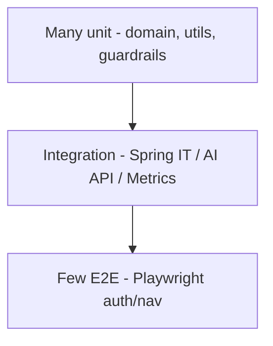

# Test Pyramid

## Counts / shape (approx from repos)

- Business: dozens of unit/slice tests; several `*IntegrationTest` + repository tests  
- Web: focused shared unit tests; two Playwright specs (including seeded session)  
- AI: `tests/unit/**` heavy; `tests/integration/**` for boot/OpenAPI/metrics/APIs  
- Contracts: generator compilation as executable specification  

## Contract testing

- Contracts repo validates OpenAPI/AsyncAPI and generates SDKs  
- AI `scripts/check_contract_compatibility.py` imports key vendored models  
- Business Feign is path-aligned, **not** Pact/Spring Cloud Contract driven  

## Interview Discussion

### Why this approach?

Pyramid keeps feedback fast while preserving a few journey tests.

### Alternative approaches

Ice cream cone (UI-heavy). Rejected.

### Trade-offs

Limited true multi-repo contract tests.

### Enterprise adoption

Add Pact or OpenAPI-driven Feign stub tests.

### Scaling considerations

Critical-path E2E only in PR; nightly broader suite.

### Principal Architect interview questions

**Q1. Is Pact used?**  
No.

**Q2. Where do most AI tests live?**  
`tests/unit` with mocks; integration for HTTP surfaces.
