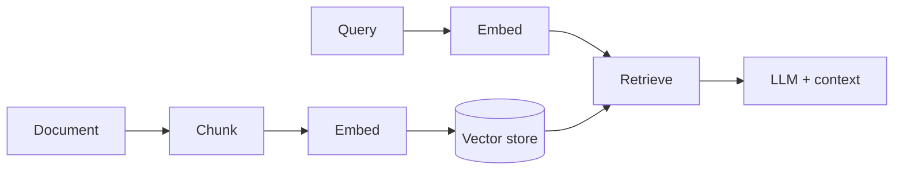

# Retrieval-Augmented Generation (RAG)

## Introduction

RAG retrieves relevant chunks from a knowledge store and conditions an LLM on that context to reduce hallucination for private corpora.

## Problem Statement

Asking a base model about a user's notes without retrieval invents answers.

## Why ACOS Uses This

ACOS Knowledge AI supports index/search/summarize paths; ingestion/chunking/embedding/retrieval live on the AI Platform with optional Qdrant and Redis caches.

## Implementation Overview

ACOS Knowledge AI supports index/search/summarize paths; ingestion/chunking/embedding/retrieval live on the AI Platform with optional Qdrant and Redis caches.

## Best Practices

- Cite/retrieve before generate for knowledge tasks.
- Separate index-time vs query-time failures.
- Business may index after-commit when AI enabled.

## Common Mistakes

- Stuffing entire corpora into prompts.
- Treating search scores as ground truth without evaluation.

## Alternative Approaches

Fine-tuning only; full-doc prompt stuffing; knowledge graphs.

## Trade-offs

Fresher private knowledge vs retrieval quality engineering. ACOS invests in pipeline + eval hooks.

## References to ACOS modules

- [06-ai-platform](../../06-ai-platform/) RAG / ingestion / retrieval docs

## Interview Questions

**Q:** Where is system of record for notes?
**A:** Business Postgres—not Qdrant.

**Q:** Summarize without vectors?
**A:** Platform also has extractive paths/configs—see AI chapter honesty notes.

## Further Reading

- Lewis et al., RAG paper; chunking practice guides

