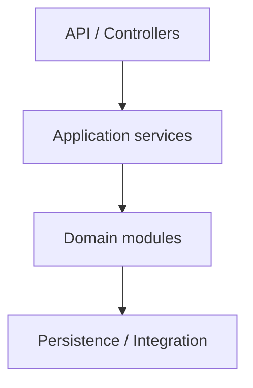

# Modular Monolith

## Introduction

A modular monolith deploys as one process while enforcing module boundaries (packages, ownership, dependency rules) similar to services—without network hops between domains.

## Problem Statement

Splitting every domain into microservices early multiplies ops cost, distributed transactions, and local DX friction for a single product team.

## Why ACOS Uses This

ACOS Business Platform keeps Auth, Knowledge, Learning, Career, Portfolio, and Integration in one Spring Boot deployable with package-level modules. AI complexity is extracted separately; product domains stay cohesive.

## Implementation Overview

Business ships as `architect-career-operating-system` on port 8080. Modules share one Postgres schema via Flyway, one security filter chain, and in-process domain events where needed. Cross-domain calls stay in-JVM.

## Best Practices

- Keep module APIs explicit; avoid deep reach into another module's persistence.
- Share kernel carefully (security, ApiResponse), not domain models.
- Extract a module only when deploy/scale/team boundaries demand it.

## Common Mistakes

- Calling it a monolith while allowing circular package dependencies.
- Premature microservice split for Career vs Learning without scaling evidence.
- Putting RAG/LLM SDKs inside domain modules.

## Alternative Approaches

Microservices; modulith frameworks with bytecode checks; single big ball of mud.

## Trade-offs

Simpler transactions and debugging vs coarser scale unit. ACOS accepts JVM-wide scale for product domains.

## References to ACOS modules

- [04-business-platform](../../04-business-platform/) Module and package docs
- ADR modular monolith decisions in [03-architecture-decision-records](../../03-architecture-decision-records/)

## Interview Questions

**Q:** When would you split Career into its own service?
**A:** Independent scale, separate release cadence, or team ownership that cannot share a DB deploy—backed by metrics, not fashion.

**Q:** How does AI fit?
**A:** Not as a Business module—separate process + contracts.

## Further Reading

- Sam Newman, *Monolith to Microservices* (extraction criteria)
- Spring Modulith documentation (conceptual peer)
