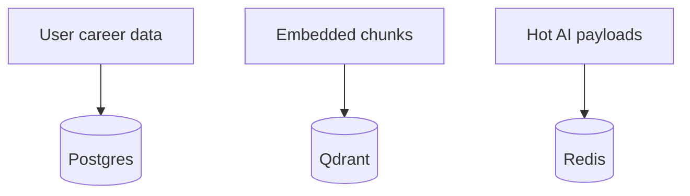

# Relational vs Vector Storage

## Introduction

Relational DBs excel at transactions and joins; vector DBs excel at approximate nearest neighbor over embeddings.

## Problem Statement

Forcing one store to do both poorly creates either weak search or weak integrity.

## Why ACOS Uses This

ACOS: Postgres for product state; Qdrant for semantic retrieval; Redis for ephemeral AI cache.

## Implementation Overview

ACOS: Postgres for product state; Qdrant for semantic retrieval; Redis for ephemeral AI cache.

## Best Practices

- Dual-write consciously (index after commit).
- Reconcile with reindex jobs.

## Common Mistakes

- Deleting notes in Postgres but not vectors.
- Storing application status only in vectors.

## Alternative Approaches

pgvector compromise; single OpenSearch cluster.

## Trade-offs

Clear responsibilities vs sync complexity—acceptable with AI optional.

## References to ACOS modules

- AI + Business data chapters 02/04/06

## Interview Questions

**Q:** Source of truth for a note body?
**A:** Postgres.

**Q:** Why not pgvector only?
**A:** Separation of AI scale/ops; Qdrant specialization—pgvector remains an alternative.

## Further Reading

- Designing data for RAG systems

