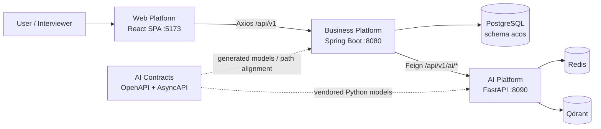
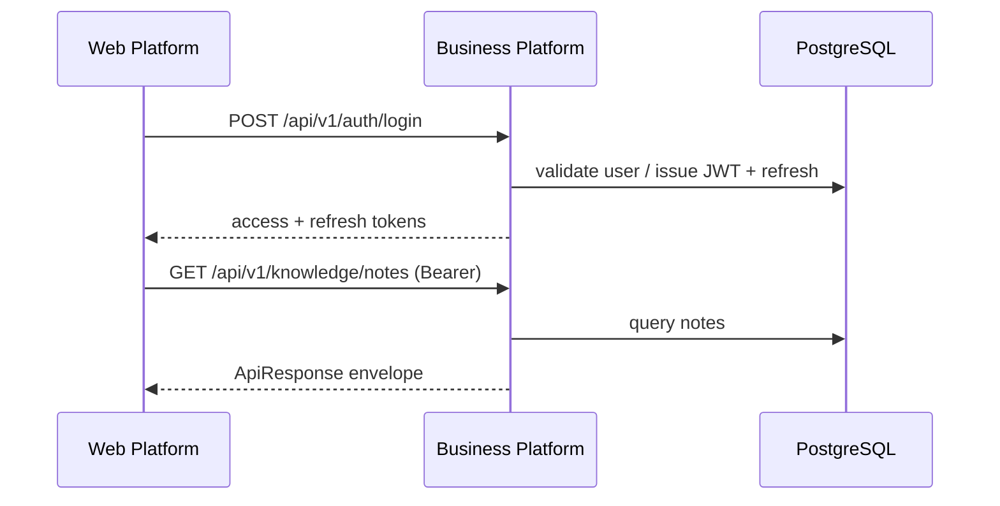
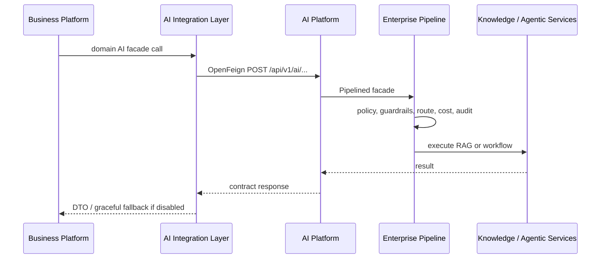

# ACOS Architecture Showcase

**Architect Career Operating System — Architecture Portfolio**

This repository is not product documentation for end users.  
It is the **architecture portfolio** of the ACOS ecosystem: what was built, why it was shaped this way, and how the repositories collaborate.

Audience: Principal Architects, Engineering Managers, technical interviewers, and senior engineers evaluating the system.

---

## Executive Summary

ACOS (Architect Career Operating System) is a multi-repository platform that helps software architects manage career progress, knowledge, learning plans, portfolios, and AI-assisted productivity workflows.

The ecosystem is deliberately split into four primary systems:

| System | Repository | Role |
| --- | --- | --- |
| Business Platform | `architect-career-operating-system` | Domain APIs, persistence, auth, AI anti-corruption layer |
| Web Platform | `architect-career-web` | React SPA / PWA for users |
| AI Platform | `architect-career-ai-platform` | Domain-agnostic RAG + agentic AI runtime |
| AI Contracts | `architect-career-ai-contracts` | OpenAPI / AsyncAPI source of truth for AI integration |

**What is implemented today**

- End-to-end CRUD for Auth, Knowledge, Learning, Portfolio, and Career tracking through Web → Business Platform → PostgreSQL.
- A separate Python AI Platform with Knowledge RAG, agentic workflows, LangGraph orchestration, and enterprise AI middleware.
- Contract-first AI REST specifications and generated SDK artifacts (Java Feign, Python, TypeScript).
- Business Platform OpenFeign clients for AI capabilities, behind a feature flag (`ai.platform.enabled`, default `false`).

**What is not yet end-to-end**

- Browser AI pages call Business Platform BFF paths that are largely not yet exposed as REST controllers (only AI health is public today).
- AsyncAPI event channels are specified; no Kafka/Pulsar bus is wired in the Business or AI platforms.
- MCP / A2A in the AI Platform are extension-point stubs, not networked implementations.
- Analytics domain and live dashboard aggregation remain stubs / placeholders.

This showcase documents **code truth first**, and labels roadmap items explicitly.

---

## Platform Vision

ACOS exists to turn career growth for architects into an operable system: structured knowledge, deliberate learning, portfolio evidence, career pipeline tracking, and AI assistance as a governed platform capability—not ad-hoc scripts.

Design philosophy:

1. **Separate business domains from AI runtime** — product rules live in Java; model/RAG/agent concerns live in Python.
2. **Contract-first AI integration** — OpenAPI/AsyncAPI define the boundary before clients diverge.
3. **Browser never talks to the AI Platform directly** — Web calls Business Platform only.
4. **Demonstrate enterprise architecture in a realistic product shape** — modular monolith + dedicated AI service + contracts repo.

Detail: [01-platform-overview/Vision.md](01-platform-overview/Vision.md)

---

## Repository Overview

```text
architect-career-web  ──HTTP /api/v1──►  architect-career-operating-system
                                              │
                                              │ OpenFeign (when AI enabled)
                                              ▼
                                     architect-career-ai-platform
                                              ▲
                                              │ vendored / generated models
                                     architect-career-ai-contracts
```

| Repository | Responsibility |
| --- | --- |
| Business Platform | JWT auth, domain REST, PostgreSQL/Flyway, in-process domain events, Feign AI gateway |
| Web Platform | Feature-sliced React UI, Axios + TanStack Query, JWT storage, PWA |
| AI Platform | FastAPI AI APIs, RAG pipeline, agentic workflows, enterprise execution pipeline |
| AI Contracts | OpenAPI 3.1 + AsyncAPI 3.0, generators, CI validation |

Detail: [01-platform-overview/Repository-Overview.md](01-platform-overview/Repository-Overview.md)

---

## Technology Stack

| Layer | Primary choices (implemented) |
| --- | --- |
| Backend | Java 21, Spring Boot 3.5, Spring Security, JPA, Flyway, OpenFeign, Resilience4j |
| Frontend | React 19, TypeScript, Vite 6, MUI 7, TanStack Query, Zustand, Zod |
| AI | Python 3.13, FastAPI, LangGraph, OpenAI / Azure OpenAI / Ollama adapters |
| Data | PostgreSQL 17 (business), Redis + Qdrant (AI; optional / configurable) |
| Contracts | OpenAPI 3.1, AsyncAPI 3.0, OpenAPI Generator |
| Observability | Actuator + Prometheus (business); structlog, Prometheus, optional LangFuse/OTEL (AI) |
| Quality | Maven verify gates (Spotless/Checkstyle/PMD/SpotBugs/JaCoCo); Vitest/Playwright; pytest/ruff/black/CI |

Detail: [01-platform-overview/Technology-Stack.md](01-platform-overview/Technology-Stack.md)

---

## High Level Architecture



### Request flow (business CRUD)



### Request flow (AI-assisted, when enabled)



---

## Platform Capabilities

### Implemented

- **Career management** — companies, recruiters, applications, interviews, offers, status history, state machine.
- **Knowledge management** — notes CRUD/search; optional after-commit AI indexing when AI is enabled.
- **Learning management** — plans, milestones, topics and status transitions.
- **Portfolio management** — projects, skills, technologies, certifications, achievements.
- **Auth & session** — register/login/refresh/logout/me with JWT + opaque refresh tokens.
- **AI Platform runtime** — knowledge index/search/summarize; chat; learning/career/portfolio AI workflows; enterprise middleware.
- **AI Contracts** — versioned REST + event schemas and multi-language generation.

### Partial / roadmap

- Web AI UX exists; Business Platform AI BFF controllers beyond health are largely missing.
- Dashboard returns configured placeholder metrics, not live aggregations.
- `analytics` package is a stub.
- AsyncAPI channels are specified but not broker-backed.
- MCP/A2A are local stubs on the AI Platform.

---

## Why this architecture was chosen

1. **Modular monolith for product domains** — one deployable Business Platform keeps transactional career/learning/portfolio consistency without premature microservices.
2. **Dedicated AI Platform** — model providers, RAG, agent graphs, and AI governance evolve independently of domain schemas.
3. **Contracts repository** — prevents Java DTOs, Python models, and future clients from drifting.
4. **Anti-corruption AI layer in Java** — Facades/Gateways/Feign isolate Resilience4j and feature flags from domain services.
5. **Web talks only to Business Platform** — security, auth, and product rules stay centralized; AI keys never reach the browser.

Trade-offs accepted today: dual stacks (Java + Python), hand-maintained Web clients (no generated SDK wired yet), and incomplete AI BFF surface between Web and Business Platform.

Detail: [01-platform-overview/Architecture-Principles.md](01-platform-overview/Architecture-Principles.md)

---

## Repository Navigation

| Chapter | Status | Path |
| --- | --- | --- |
| 01 Platform Overview | Complete | [01-platform-overview/](01-platform-overview/) |
| 02 System Design | **Complete** | [02-system-design/](02-system-design/) |
| 03 Architecture Decision Records | **Complete** | [03-architecture-decision-records/](03-architecture-decision-records/) |
| 04 Business Platform | **Complete** | [04-business-platform/](04-business-platform/) |
| 05 Web Platform | **Complete** | [05-web-platform/](05-web-platform/) |
| 06 AI Platform | **Complete** | [06-ai-platform/](06-ai-platform/) |
| 07 AI Contracts | **Complete** | [07-ai-contracts/](07-ai-contracts/) |
| 08 Engineering Excellence | **Complete** | [08-engineering-excellence/](08-engineering-excellence/) |
| 10 Engineering Knowledge | **Complete** | [10-engineering-knowledge/](10-engineering-knowledge/) |

> Former placeholders `08-devops` … `15-roadmap` are superseded by the consolidated Engineering Excellence Handbook (DevOps, Security, Performance, Testing, Runbooks, Interview, Lessons, Roadmap, Demo). Chapter **10** is the Engineering Knowledge Base (concepts & technologies)—not a second architecture handbook.

### Chapter 01 documents

- [Vision.md](01-platform-overview/Vision.md)
- [Business-Goals.md](01-platform-overview/Business-Goals.md)
- [Platform-Overview.md](01-platform-overview/Platform-Overview.md)
- [Repository-Overview.md](01-platform-overview/Repository-Overview.md)
- [Technology-Stack.md](01-platform-overview/Technology-Stack.md)
- [Architecture-Principles.md](01-platform-overview/Architecture-Principles.md)

### Chapter 03 documents

- [ADR Index](03-architecture-decision-records/README.md)
- [Future Decisions](03-architecture-decision-records/Future-Decisions.md)
- ADR-001 … ADR-030 (Overall Architecture through Code Generation)

### Chapter 04 documents

- [Business Platform Index](04-business-platform/README.md)
- Overview, domains, modules, packages, layers, API, security, persistence, integration, exceptions, validation, configuration, observability, testing, performance, deployment, future enhancements

### Chapter 05 documents

- [Web Platform Index](05-web-platform/README.md)
- Overview, application architecture, project structure, routing, state, API integration, authentication/authorization, components, design system, forms, errors, performance, accessibility, security, testing, build, future enhancements

### Chapter 06 documents

- [AI Platform Index](06-ai-platform/README.md)
- Overview, layered architecture, capability registry, enterprise RAG, ingestion through evaluation, LangGraph/workflows/tools/memory, model router, guardrails, observability, security, testing, performance, deployment, future enhancements

### Chapter 07 documents

- [AI Contracts Index](07-ai-contracts/README.md)
- Overview, contract-first architecture, OpenAPI, AsyncAPI, schema design, reusable components, code generation, artifact publishing, versioning, backward compatibility, consumer integration, Java SDK, Python models, TypeScript SDK, validation, CI/CD, governance, repository workflow, future enhancements

### Chapter 08 documents

- [Engineering Excellence Index](08-engineering-excellence/README.md)
- DevOps, Infrastructure, Security, Observability, Performance, Testing, **Operations Handbook (Runbooks)**, Governance, Interview Guide, Lessons Learned, Roadmap, Demo

### Chapter 10 documents

- [Engineering Knowledge Base Index](10-engineering-knowledge/README.md)
- Architecture, Backend, Frontend, AI, Distributed Systems, Security, Database, Observability, Cloud, DevOps, and Patterns concept guides (ACOS-grounded)

---

## Documentation Roadmap

1. **Chapter 01** — orientation and ecosystem map *(complete)*.
2. **Chapter 02** — enterprise system design, C4, runtime/data/security/AI architecture *(complete)*.
3. **Chapter 03** — formal ADRs extracted from implemented decisions *(complete)*.
4. **Chapter 04** — Business Platform deep dive *(complete)*.
5. **Chapter 05** — Web Platform deep dive *(complete)*.
6. **Chapter 06** — AI Platform deep dive *(complete)*.
7. **Chapter 07** — AI Contracts deep dive *(complete)*.
8. **Chapter 08** — Engineering Excellence Handbook *(complete)* — consolidates DevOps through roadmap/demo.
9. **Chapter 10** — Engineering Knowledge Base *(complete)* — technologies, concepts, and patterns behind ACOS.

Older charter/vision drafts may still exist at the repository root for historical reference. **This portfolio structure is the canonical navigation going forward.**

---

## Quick Start

Prerequisites: Java 21, Maven, Node 20+, Python 3.13, Docker (for Postgres / Redis / Qdrant as needed).

```bash
# 1) Business data store
cd architect-career-operating-system/infrastructure/docker
docker compose up -d

# 2) Business Platform
cd architect-career-operating-system
./mvnw spring-boot:run
# http://localhost:8080

# 3) Web
cd architect-career-web
npm install
npm run dev
# http://localhost:5173  (proxies /api → :8080)

# 4) AI Platform (optional)
cd architect-career-ai-platform
docker compose up -d redis qdrant   # if using those backends
py -3.13 -m pip install -e ".[dev]"
py -3.13 -m uvicorn app.main:app --host 0.0.0.0 --port 8090

# 5) Enable AI from Business Platform only when ready
# ai.platform.enabled=true
# ai.platform.base-url=http://localhost:8090
```

Contracts generation (when changing AI APIs):

```bash
cd architect-career-ai-contracts
mvn -B clean verify
# then sync Python models into the AI Platform third_party package
```

---

## Future Enhancements

Documented as roadmap—not claimed as shipped:

- Business Platform AI BFF controllers matching Web `/api/v1/integration/ai/**` clients.
- Wire generated Java/TS SDKs instead of hand-maintained clients where appropriate.
- Broker-backed AsyncAPI events between Business and AI platforms.
- Live dashboard/analytics aggregations.
- Production hardening of AI auth defaults, distributed rate limits, and real MCP/A2A integrations.
- Unified CI/CD and container packaging across all product repos.

---

## Documentation integrity rule

> If it is not in code, config, or contracts, it is not described as implemented.  
> Planned work is labeled **Future roadmap**.
